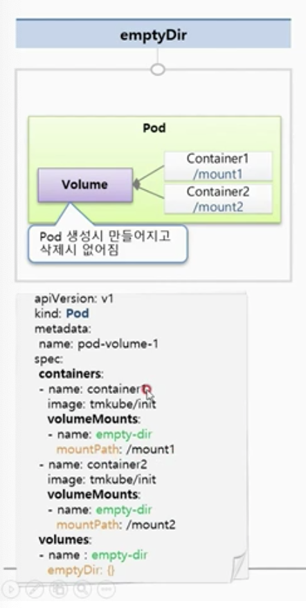
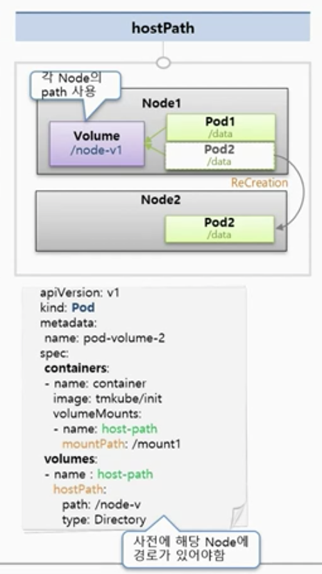
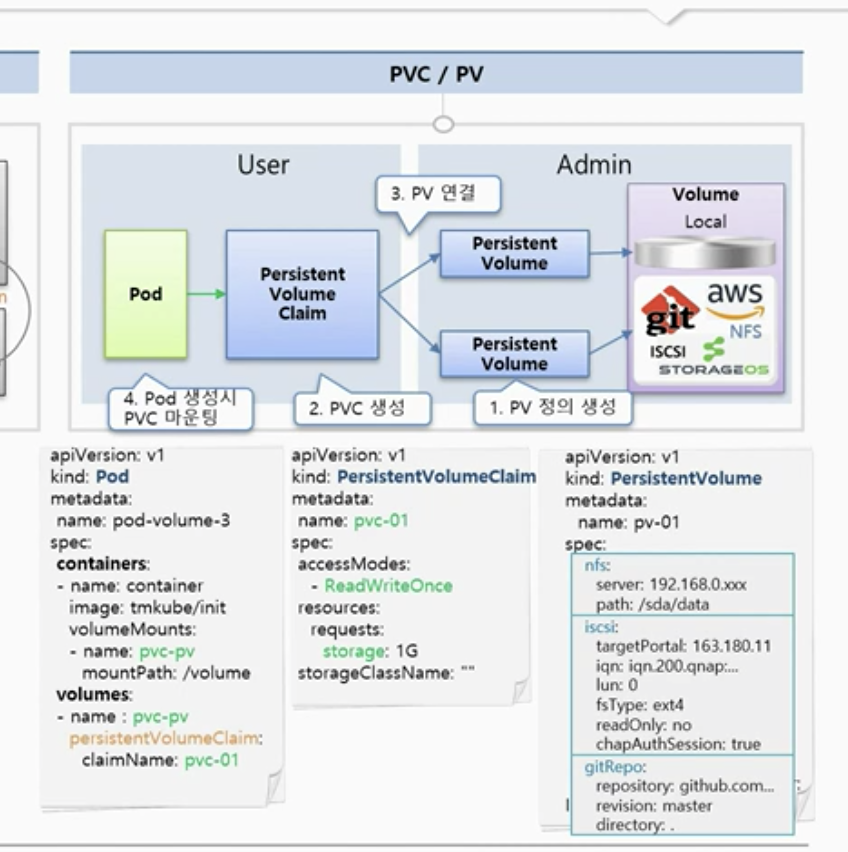
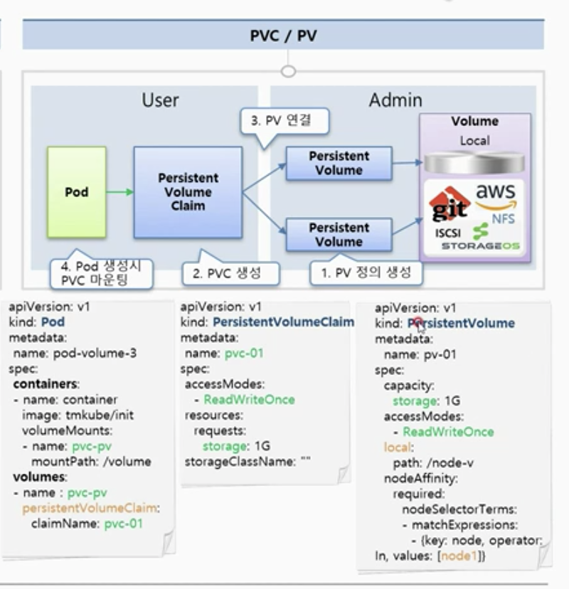

# 10장. Volume - emptyDir, hostPath, PV/PVC

### EmptyDir

* 컨테이너끼리 데이터를 공유하기 위해 볼륨을 사용하는 것.
* 최초 볼륨은 항상 비어있기 때문에 EmptyDir이라는 이름.
* Pod 생성 시 만들어지고 삭제 시 없어짐. \(일시적인 사용 목적에 의한 데이터만 보관할 것.\)

container1은 /mount1이라는 이름으로, container2는 /mount2라는 이름으로 emptyDir{} 패스를 마운트해서 사용함.

### hostPath

* 파드들이 올라간 노드의 path를 볼륨으로 사용
* 파드들이 죽어도 노드에 있는 데이터는 사라지지 않음.
* 좋아보이는데 만약 pod2가 죽고 node2에 생긴다면? 파드에 장애가 생겨서 다른 노드로 옮겨야한다면? 해당 노드에 볼륨이 없으면 사용할 수 없음.

  * 노드를 추가할 때마다 Mount를 걸어주는 방식으로 구성할 수는 있으나 운영자가 직접 해주어야 함. 자동화가 안되어 있기 때문에 추천하지는 않음.
  * 파드에서 노드에 있는 데이터를 쓰기 위한 용도로 사
    용

 

### PVC / PV

* 파드에 영속성 있는 볼륨을 제공하기 위한 것
* 볼륨은 로컬에도 있을수 있지만 AWS, NFS, 볼륨을 직접 만들 수 있는 솔루션들이 있음.
* 이런 볼륨과 Persistent Volume과 연결함.
* Pod는 PV와 직접 연결하는게 아니라 Persistent Volume Claim을 통해 연결함.
* 왜 PV에 직접 연결하지 않고 하나 거쳐갈까?

  * kubernetes는 user 영역과 admin 영역이 나누어짐.
  * 각 볼륨들을 연결하기 위한 설정과 같은 것은 admin이 전문적으로 신경쓰고
  * 유저는 PVC에 해당 PV 볼륨을 몇기가를 쓸지, 읽기쓰기 모드로 쓸지 등의 간단한 설정을 통해 쓸 수 있음.
  * Pod에서는 claimName에 앞에서 만든 PVC를 사용함.

PV를 local로 설정하면 아래와 같음.

