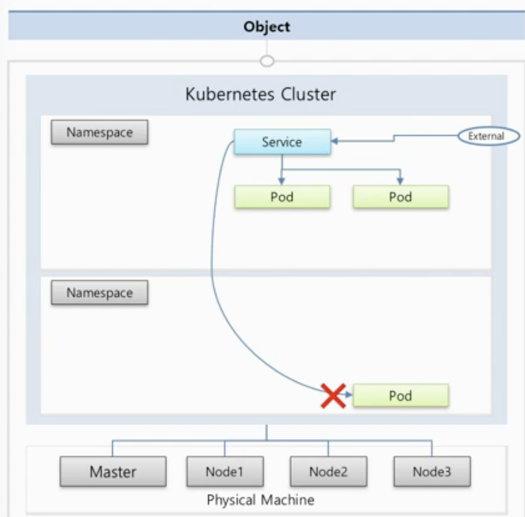
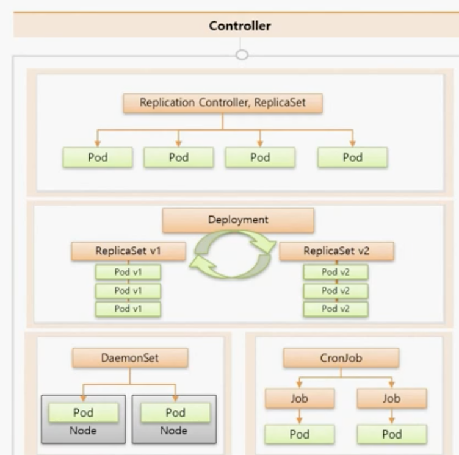

# 5강. Kubernetes Overview

* kubernetes cluster
  * master: 관리하는 애
  * node: 자원을 제공하는 애들 (cpu, memory..)
  * namespace
    * 각 노드들 위에 namespace로 분리된 공간을 제공
    * 서로 다른 namespace로는 통신할 수 없음.
    * namespace당 자원 할당량을 제한할 수 있음. (resource quata / limit range를 이용)
  * service
    * 밖에서 pod내에 접근할 수 있도록 서비스로 네트워크를 열어줄 수 있음.

* pod
  * 하나의 pod에는 여러 container가 뜰 수 있음.
  * container가 내려가면 데이터들이 날아가기 때문에 volume을 연결해서 데이터를 보관할 수 있음.
  * configMap, Secret을 이용하여 config 연결하거나 파일을 마운팅할 수 있음 

* Controller (Pod를 관리해주는 애들)
  *
    Replication Controller, ReplicaSet
    * Pod가 죽으면 감지해서 다시 살려 준다.
    * Pod의 갯수를 늘렸다가 줄이는 Scale In/Out을 해줌
  * Deployment
    * 배포 후에 Pod들을 새 버전으로 업그레이드 해
    *
      업그레이드하다 문제가 생기면 롤백하기 쉽게 도와줌.
  * DaemonSet
    * 한 노드에 한 파드가 하나씩만 돌아가도록 해줌
  *   CronJob

      * Job: 어떤 특정 일만 하고 종료가 되도록 하는 파드들을 동작시킴
      * 이런 Job들을 특정 시간마다 주기적으로 동작시키고 싶을 때 CronJob을 사용함.

