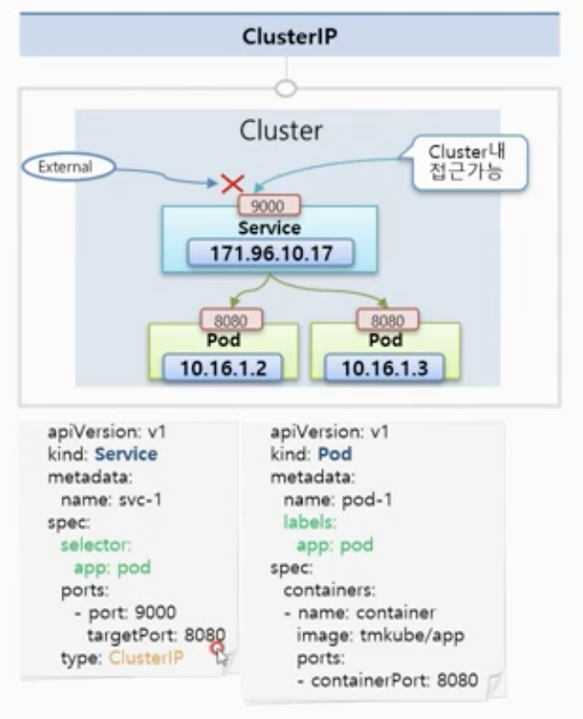
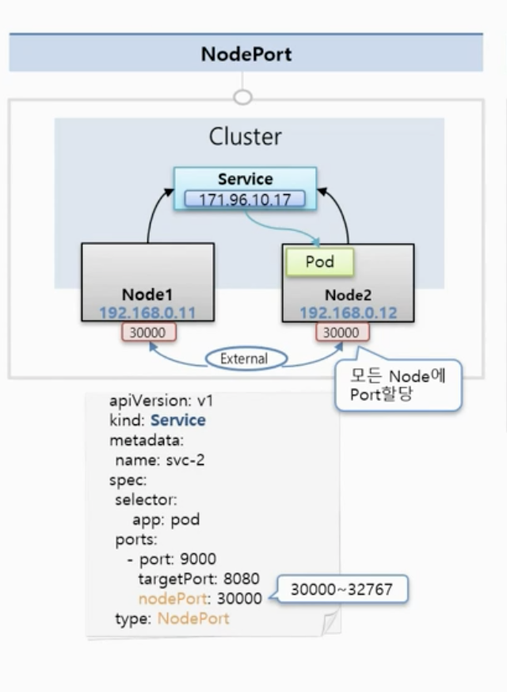
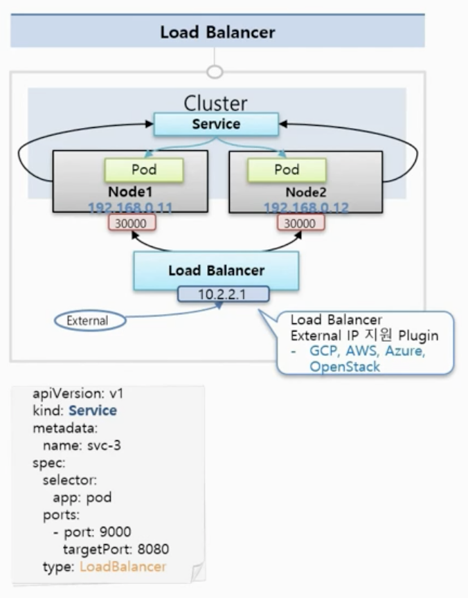
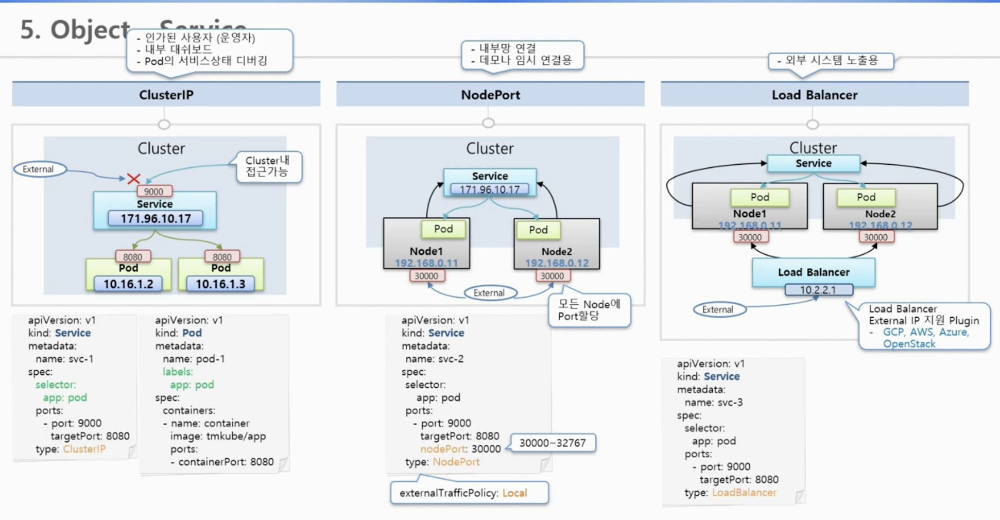

# 8강. Service - ClusterIP, NodePort, LoadBalancer

### Service

* 서비스는 기본적으로 자신의 ClusterIP를 가지고 있음. 이 서비스를 Pod에 연결하면 서비스의 IP를 통해 Pod에 접근할 수 있음.
* Pod는 죽으면 자동으로 재시작할 수 있도록 설계되어있는 Object이기 때문에 Pod의 Ip가 바뀜. Service는 사용자가 직접 지우지 않는한 항상 연결되어 있는 파드로 연결할 수 있음.

### ClusterIP

* 클러스터 내에서만 접근할 수 있는 IP\(외부에서 접근 불가능\)
* 여러 파드를 연결 가능. 서비스가 트래픽을 분산해서 파드에 전달해줌.

### NodePort

* 모든 Node에 포트를 할당해서 서비스를 연결해줄 수 있음.
* 각 노드에 파드가 하나씩 올라가 있다면 1번 노드에 IP로 접근하더라도 다른 노드에 있는 파드에 트래픽을 전달할 수 있음.
* 단, externalTrafficPolicy: Local로 하면 특정 노드에 올라간 Pod에만 트래픽을 전달하도록 설정할 수 있음.

### Load Balancer

* 로드밸런스에 외부 접속 IP를 할당해주는 플러그인을 설치해야 외부에서 접근할 수 있는 IP를 생성해줌.

### 각 서비스 타입 별 사용 유형

###  1. ClusterIP

* 인가된 사용자\(운영자\)
* 내부 대시보드
* Port의 서비스상태 디버깅

### 2. NodePort

* 내부망 연결
* 데모나 임시 연결용

### 3. Load Balancer

* 외부 시스템 노출

