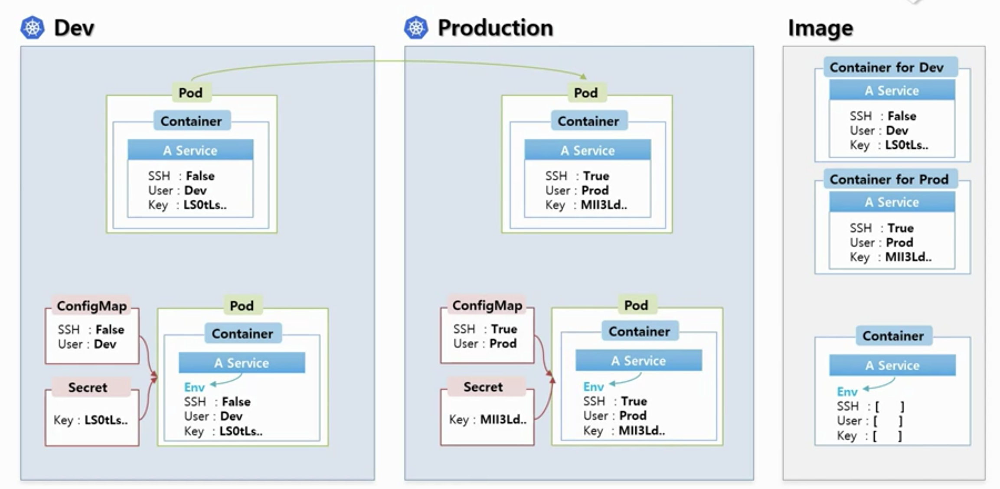
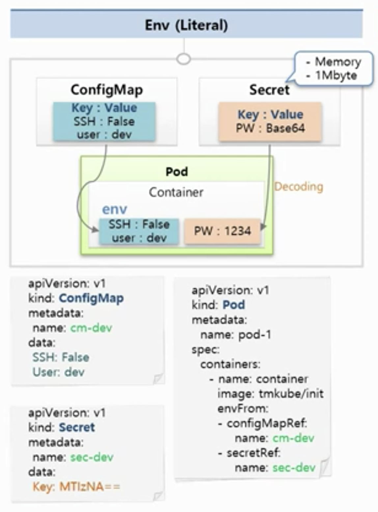
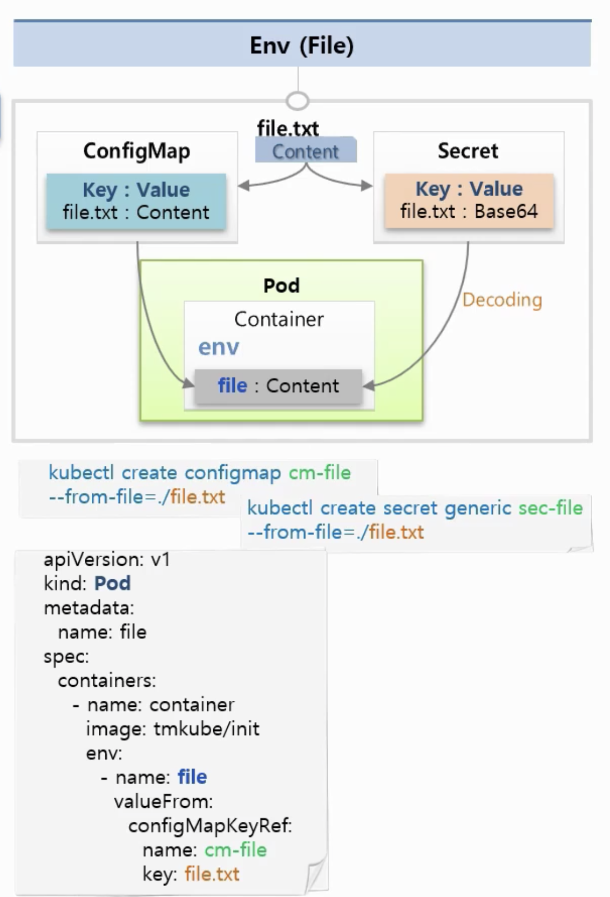
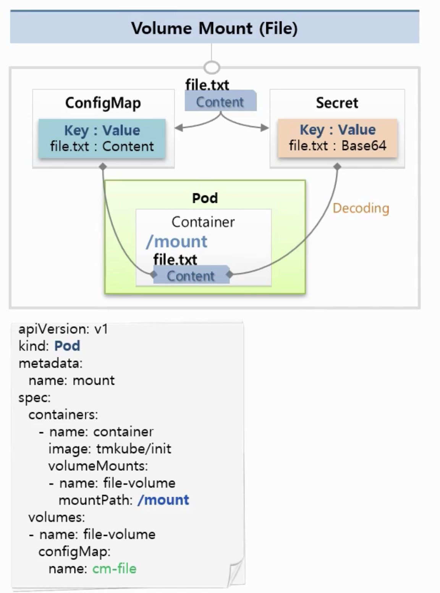

# 12장. ConfigMap, Secret - Env, Mount

### ConfigMap와 Secret을 사용해야 하는 상황

* Dev 서버와 Prod 서버가 있을 때, Dev에서는 보안접속을 하지 않고, Prod환경에서는 보안접속을 한다면? 그리고 각 환경마다 User와 Key 이 다를 경우
  * * 이런 경우 컨테이너 이미지를 관리해야 할까?
    * 환경에 따라 변하는 값은 외부에서 결정하게 하는데, 이 때 도와주는 오브젝트가 ConfigMap과 Secret이다!
* ConfigMap, Secret을 모아 컨테이너의 Env 값으로 넣어준다.

### ConfigMap와 Secret 사용

* 데이터로 상수를 넣거나 File을 넣을 수 있음. 

#### Env \(Literal 상수\)

* ConfigMap
  * Key, Value로 되어 있음.
* Secret

  * Key, Value 쌍으로 되어있고 Value를 만들 때 base64로 만들어야 함. \(실제 Container에 들어갈 때에는 디코딩되서 들어감.\)
  * 메모리에 저장됨 \(파일로 저장되는 것보다 메모리에 저장되는 것이 안전하므로\)
  * 1Mbyte가 최대
  * 메모리에 저장되기 때문에 많이 만들면 문제가 생길 수 있으니 주의할 것.

#### Env\(File\)

* ConfigMap
  * 파일을 통째로 ConfigMap에 넣을 수 있음.
  * Key: 파일 이름, Value: 컨텐츠
  * container에 env값의 파일 이름\(key\)은 변경해줄 수 있음.
* Secret

  * 파일을 통째로 Secret을 통해 넣을 수 있음. 파일은 Base64로 암호화되어 저장됨.
  * Key: 파일 이름, Value: base64로 암호화된 컨텐

#### Volume Mount \(File\)

* ConfigMap
  * 파일을 통째로 ConfigMap에 넣을 수 있음.
  * Key: 파일 이름, Value: 컨텐츠
  * container에 env값의 파일 이름\(key\)은 변경해줄 수 있음.
* Secret
  * 파일을 통째로 Secret을 통해 넣을 수 있음. 파일은 Base64로 암호화되어 저장됨.
  * Key: 파일 이름, Value: base64로 암호화된 컨텐츠
* Env\(File\)과 동일한데, 볼륨을 마운트해서 사용한다는 부분만 다름.

#### Volume Mount와 Env\(File\)은 무슨 차이일까?

만약 각각의 파일을 수정하게 되면 어떻게 될까?

* Env\(File\)
  * Env로 넣을 때에는 기존 파일이 수정되어도 컨테이너가 만들어지는 순간이 아니면 영향을 받지 않음. \(컨테이너를 내렸다 올려야 수정된 사항을 반영할 수 있음.\)
* Volume Mount\(File\)
  * 기존 파일을 수정하면 컨테이너 위에 올라간 파일도 수정됨. \(마운트가 되어 있기 때문에\)

