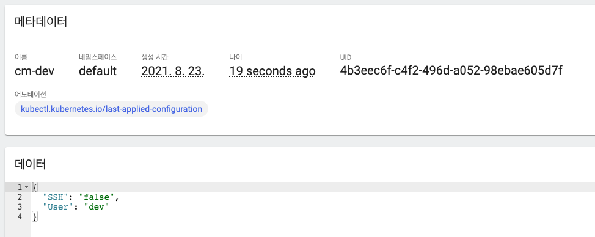
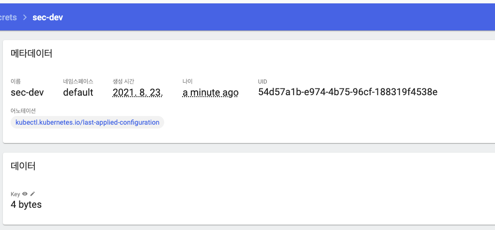
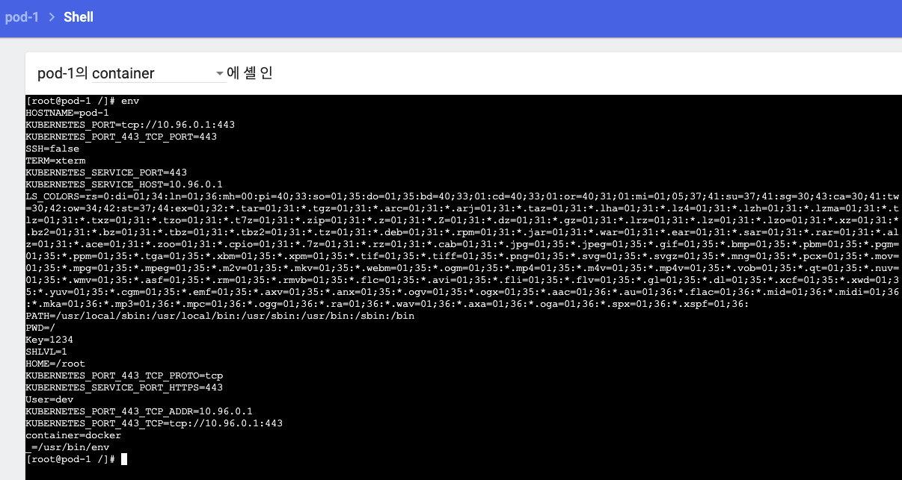
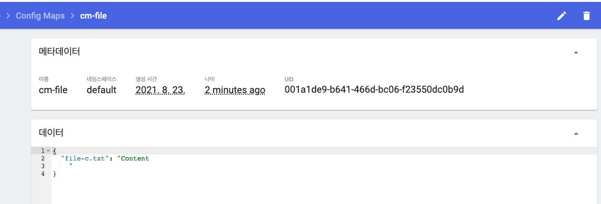
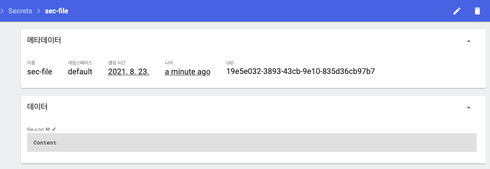
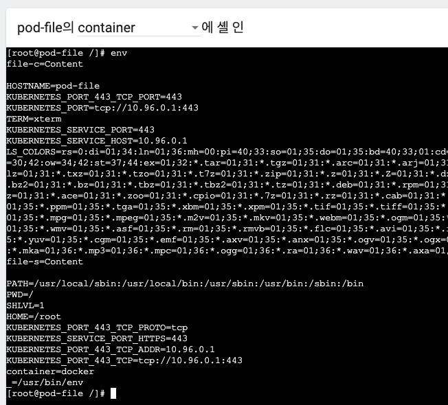
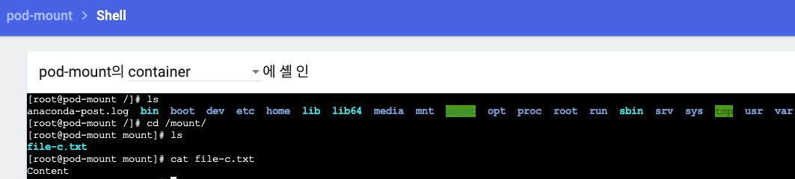

# 13장. ConfigMap, Secret - 실습

### Env\(Literal\)

#### ConfigMap

```text
apiVersion: v1
kind: ConfigMap
metadata:
  name: cm-dev
data:
  SSH: 'false'
  User: dev
```

data의 Key, Value의 value값은 기본이 string이기 때문에 boolean 값을 넣으면 에러가 나기 때문에 ''로 묶어주어야 함.



대시보드에서도 생성된 값을 볼 수 있음. \(이렇게 쉽게 대시보드에서 확인할 수 있기 때문에 보안상의 이유로 상용에서는 Dashboard를 사용하지 않음.\)

#### Secret

```text
apiVersion: v1
kind: Secret
metadata:
  name: sec-dev
data:
  Key: MTIzNA==
```

secret의 data에 key, value의 value값에 base64로 인코딩하지 않은 값을 넣게 되면 배포가 실패하게 됨.



#### Pod

```text
apiVersion: v1
kind: Pod
metadata:
  name: pod-1
spec:
  containers:
  - name: container
    image: kubetm/init
    envFrom:
    - configMapRef:
        name: cm-dev
    - secretRef:
        name: sec-dev
```



생성된 파드의 컨테이너에서 env를 치면 만들었던 ConfigMap과 Secret이 잘 들어가 있는 것을 확인할 수 있음. \(Key값에 Secret이 디코딩되서 들어간 것 확인!\)

### Env\(File\)

#### ConfigMap

```text
echo "Content" >> file-c.txt
kubectl create configmap cm-file --from-file=./file-c.txt
```



#### Secret

```text
echo "Content" >> file-s.txt
kubectl create secret generic sec-file --from-file=./file-s.txt
```



#### Pod

```text
apiVersion: v1
kind: Pod
metadata:
  name: pod-file
spec:
  containers:
  - name: container
    image: kubetm/init
    env:
    - name: file-c
      valueFrom:
        configMapKeyRef:
          name: cm-file
          key: file-c.txt
    - name: file-s
      valueFrom:
        secretKeyRef:
          name: sec-file
          key: file-s.txt
```



파일을  변경하고 컨테이너를 내렸다 올리면 반영됨.

### Volume Mount\(File\)

#### Pod

```text
apiVersion: v1
kind: Pod
metadata:
  name: pod-mount
spec:
  containers:
  - name: container
    image: kubetm/init
    volumeMounts:
    - name: file-volume
      mountPath: /mount
  volumes:
  - name: file-volume
    configMap:
      name: cm-file
```



파일을 변경하면 변경한 파일이 바로 반영됨.

