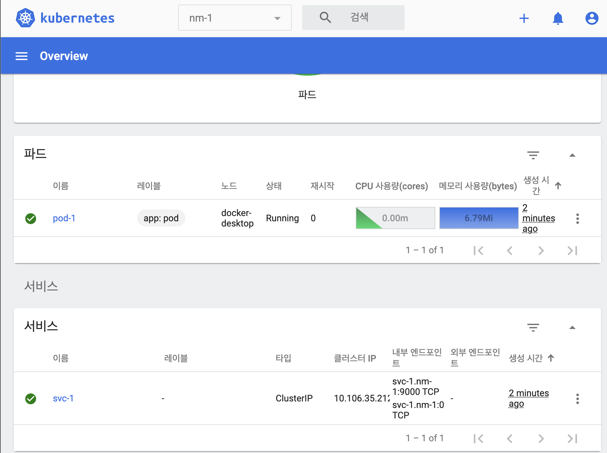
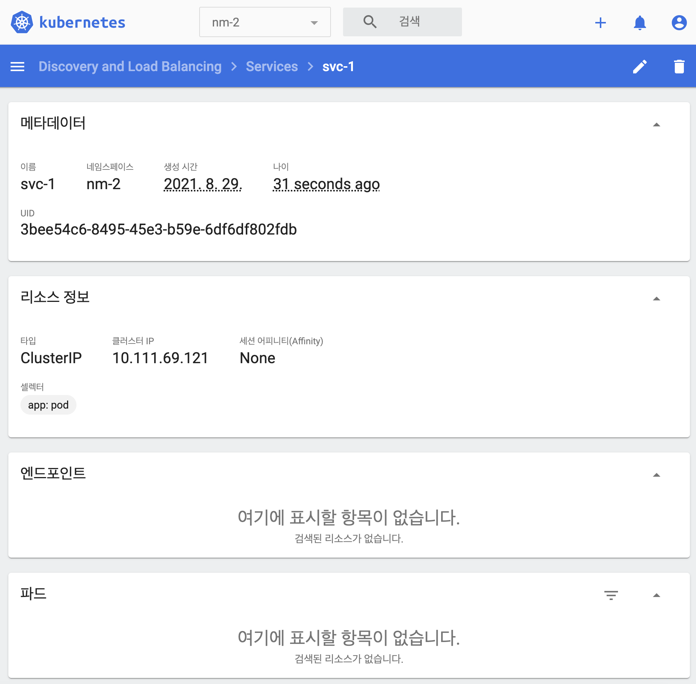

# 15장. Namespace, ResourceQuota, LimitRange - 실습

## Namespace

### 1. namespace

#### 1-1\) namespace

```text
apiVersion: v1
kind: Namespace
metadata:
  name: nm-1
```

#### 1-2\) pod

```text
apiVersion: v1
kind: Pod
metadata:
  name: pod-1
  namespace: nm-1
  labels:
    app: pod
spec:
  containers:
  - name: container
    image: kubetm/app
    ports:
    - containerPort: 8080
```

#### 1-3\) service

```text
apiVersion: v1
kind: Service
metadata:
  name: svc-1
  namespace: nm-1
spec:
  selector:
    app: pod
  ports:
  - port: 9000
    targetPort: 8080
```



#### 같은 namespace에 같은 이름의 pod를 생성하려 할 경우


#### 다른 namespace에 있는 pod에는 접근이 되지 않는다. 

```text
apiVersion: v1
kind: Namespace
metadata:
  name: nm-2
```

```text
apiVersion: v1
kind: Service
metadata:
  name: svc-1
spec:
  selector:
    app: pod
  ports:
  - port: 9000
    targetPort: 8080
```

namespace를 지정하지 않음.   
현재 namespace인 nm-2에 서비스 생성을 하지만, pod가 없어서 연결이 안됨.



다시 해당 namespace 내에 pod를 생성하면 접근 가능.

```text
apiVersion: v1
kind: Pod
metadata:
  name: pod-1
  labels:
    app: pod
spec:
  containers:
  - name: container
    image: kubetm/app
    ports:
    - containerPort: 8080
```


#### 다른 namespace로 ip 접근이 되는지 확인

nm1-svc\) clusterIP: 10.106.35.212:8080/hostname

nm1-pod\) podIP: 10.1.0.90:8080/hostname

nm2 -&gt; nm1로 접근 가능.

접근을 막으려면 network-policy 설정을 해야 함.

#### nodeport는 namespace별 나눌 수 없음.

```text
apiVersion: v1
kind: Service
metadata:
  name: svc-2
spec:
  ports:
  - port: 9000
    targetPort: 8080
    nodePort: 30000
  type: NodePort
```


#### hostpath는 namespace별 나눌 수 없음.

```text
apiVersion: v1
kind: Pod
metadata:
 name: pod-2
spec:
  nodeSelector:
    kubernetes.io/hostname: k8s-node1
  containers:
  - name: container
    image: kubetm/init
    volumeMounts:
    - name: host-path
      mountPath: /mount1
  volumes:
  - name : host-path
    hostPath:
      path: /node-v
      type: DirectoryOrCreate
```

```text
echo "hello" >> hello.txt
```


pod security policy에 유저 레벨로 변경해야 해당 파일이 보이지 않음.

## ResourceQuota

```text
apiVersion: v1
kind: Namespace
metadata:
  name: nm-3
```

```text
apiVersion: v1
kind: ResourceQuota
metadata:
  name: rq-1
  namespace: nm-3
spec:
  hard:
    requests.memory: 1Gi
    limits.memory: 1Gi
```

```text
kubectl describe resourcequotas --namespace=nm-3
```


위 namespace에 resource를 빼고 만들면?

```text
apiVersion: v1
kind: Pod
metadata:
  name: pod-2
spec:
  containers:
  - name: container
    image: kubetm/app

```


```text
apiVersion: v1
kind: Pod
metadata:
  name: pod-3
spec:
  containers:
  - name: container
    image: kubetm/app
    resources:
      requests:
        memory: 0.5Gi
      limits:
        memory: 0.5Gi
```

```text
apiVersion: v1
kind: Pod
metadata:
  name: pod-3
  namespace: nm-3
spec:
  containers:
  - name: container
    image: kubetm/app
    resources:
      requests:
        memory: 0.8Gi
      limits:
        memory: 0.8Gi
```


#### pod 갯수 제한

```text
apiVersion: v1
kind: ResourceQuota
metadata:
  name: rq-2
spec:
  hard:
    pods: 2
```

```text
apiVersion: v1
kind: Pod
metadata:
  name: pod-4
  namespace: nm-3
spec:
  containers:
  - name: container
    image: kubetm/app
    resources:
      requests:
        memory: 0.1Gi
      limits:
        memory: 0.1Gi
```


#### 주의사항

```text
apiVersion: v1
kind: Namespace
metadata:
  name: nm-4
```

namespace를 만들고, resource quota 없이 pod를 몇 개 만든다.

```text
apiVersion: v1
kind: Pod
metadata:
  name: pod-1
  namespace: nm-4
spec:
  containers:
  - name: container
    image: kubetm/app
```

```text
apiVersion: v1
kind: Pod
metadata:
  name: pod-2
  namespace: nm-4
spec:
  containers:
  - name: container
    image: kubetm/app
```

이상태에서 리소스 쿼타를 만든다면?

```text
apiVersion: v1
kind: ResourceQuota
metadata:
  name: rq-1
  namespace: nm-4
spec:
  hard:
    requests.memory: 1Gi
    limits.memory: 1Gi
```

걍 만들어짐; 기존에 있던 파드들은 그대로 limit이 정의되지 않은 상태임.

이상태에서 1G memory를 사용하는 pod를 생성한다면?

```text
apiVersion: v1
kind: Pod
metadata:
  name: pod-3
  namespace: nm-4
spec:
  containers:
  - name: container
    image: kubetm/app
    resources:
      requests:
        memory: 1Gi
      limits:
        memory: 1Gi
```


강의에서는 만들어지니까 주의하라고 했는데 만들어지지 않음.

쿠베 버전차이인듯

## LimitRange

```text
apiVersion: v1
kind: Namespace
metadata:
  name: nm-5
```

```text
apiVersion: v1
kind: LimitRange
metadata:
  name: lr-1
spec:
  limits:
  - type: Container
    min:
      memory: 0.1Gi
    max:
      memory: 0.4Gi
    maxLimitRequestRatio:
      memory: 3
    defaultRequest:
      memory: 0.1Gi
    default:
      memory: 0.2Gi
```

```text
kubectl describe limitranges --namespace=nm-5
```


```text
apiVersion: v1
kind: Pod
metadata:
  name: pod-1
spec:
  containers:
  - name: container
    image: kubetm/app
    resources:
      requests:
        memory: 0.1Gi
      limits:
        memory: 0.5Gi
```


```text
apiVersion: v1
kind: Pod
metadata:
  name: pod-1
spec:
  containers:
  - name: container
    image: kubetm/app
    resources:
      requests:
        memory: 0.2Gi
      limits:
        memory: 0.4Gi

```

```text
apiVersion: v1
kind: Pod
metadata:
  name: pod-2
spec:
  containers:
  - name: container
    image: kubetm/app
```


명시를 안하면 위와 같이 default로 생성됨.

#### 주의사항

```text
apiVersion: v1
kind: Namespace
metadata:
  name: nm-6
```

하나의 namespace에는 여러개의 limitRange를 넣을 수 있음.

```text
apiVersion: v1
kind: LimitRange
metadata:
  name: lr-5
spec:
  limits:
  - type: Container
    min:
      memory: 0.1Gi
    max:
      memory: 0.5Gi
    maxLimitRequestRatio:
      memory: 1
    defaultRequest:
      memory: 0.5Gi
    default:
      memory: 0.5Gi
```

```text
kubectl describe limitrange --namespace=nm-6
```


limit range 두개가 생성됨.

```text
apiVersion: v1
kind: Pod
metadata:
  name: pod-1
spec:
  containers:
  - name: container
    image: kubetm/app
```


min값을 보는 limit range와 default 값을 보는 limit range가 각각 다른걸 보면서 예상치 못한 에러가 발생할 수 있음.

한 namespace에 여러개의 limit range를 설정하면 예상치 못한 결과가 나올 수 있으므로 주의할 것.


