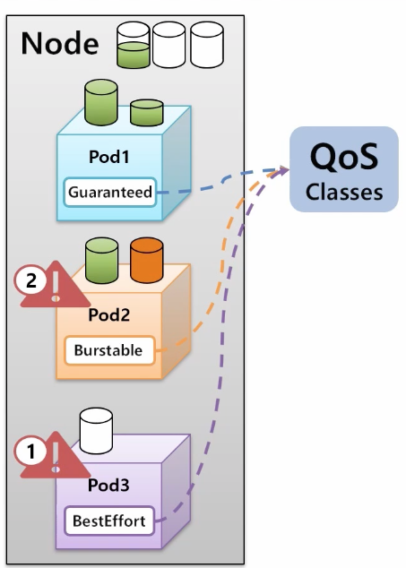
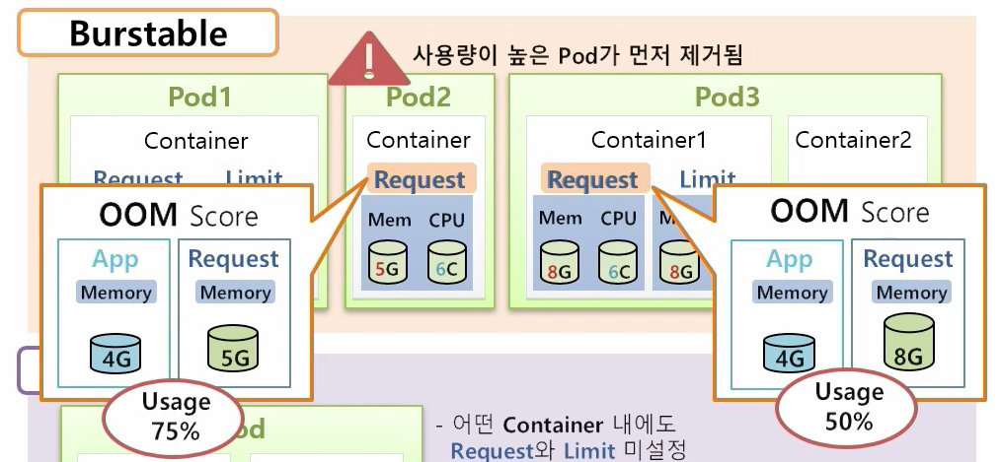

# 25장. Pod - QoS Classes

## 1. QoS Classes가 사용되는 경우

* 노드에 Pod1, 2, 3가 균등한 자원을 가지고 있고, 더이상 노드에 자원이 없는 상태에서 Pod1에 추가적으로 자원이 필요한 상황.
* 이럴 때 생성이 안되는 것이 맞는가? 아니면 다른 파드에서 자원을 가져오는 것이 맞는가?
* 이런 우선순위를 정해주기 위해 QoS\(Quality of Service\) Classes라는 것을 설정해 줄 수 있음.
  * Guaranteed &gt; Burstable &gt; BestEffort \(우선순위\)

따로 속성 값이 있는 것이 아니라 Pod의 Container의 resources를 어떻게 주었는지에 따라 결정됨.

### 1. Guaranteed

* 모든 Container에 Request와 Limit이 설정되어 있고, Request와 Limit에는 Memory와 CPU가 모두 설정되어 있고, Request와 Limit 값이 동일한 경우

### 2. Burstable

* Request와 Limit 값이 설정되어 있지만 Request &lt; Limit 인 경우
* Request 값만 설정되어 있는 경우
* 파드 안에 하나의 Container는 Request와 Limit 이 모두 설정되어 있고 값이 동일하지만 다른 Container에는 설정되어 있지 않은 경우

### 3. BestEffort

* Request, Limit이 설정되지 않은 경

### Burstable 내 우선순위

* 위 상황에서 자원이 부족하면 어디서 충당할것인가? 
* 우선순위는 OOM Score가 높은 것이 먼저 삭제됨.
* OOM Score는 App의 실제 사용량 / Request 값을 Usage로 보고, 사용량이 더 높은 Pod를 먼저 제거함.

