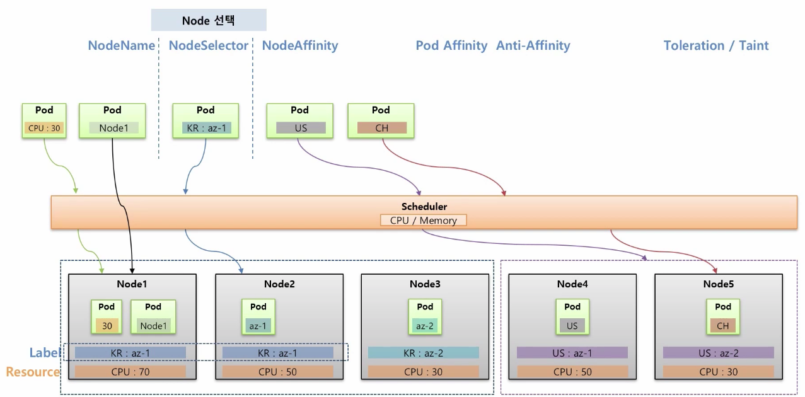

# 26장. Pod - Node Scheduling

## Node 선

### 1. NodeName

* 파드를 띄울 노드를 직접 명시 \(실제 환경에서는 노드가 추가되고 삭제되면서 변경될 가능성이 높아 잘 사용되지 않음.\)

### 2. NodeSelector

* 노드에 지정해둔 label의 key, value 값을 따라 띄워주지만, 해당하는 label을 가진 Node가 없으면 생성할  에러가 나게 됨.

### 3. NodeAffinity

* 해당하는 라벨의 key 값을 보고 적절한 노드에 띄워줌.
* 만약 해당하는 노드가 없으면 자원이 많이 있는 노드에 띄워주도록 설정해줄 수도 있음.

## Pod간 집중/분산

### 1. Pod Affinity

* 여러 파드를 집중해서 한 노드에 띄워주도록 하는 것
* 예\) 만약 한 PV에 물려 뜨는 Web과 Server가 있을 때, 이건 한 노드에 같이 떠야 문제가 없음.

### 2. Anti-Affinity

* 파드들 간에 겹치지 않도록를 분해서 띄워주는 것산
* 예\) 마스터가 죽으면 슬레이브 파드가 백업을 해주어야 하는 경우

##  Node에 할당 제한

특정 노드에는 아무 파드나 띄울 수 없도록 제한을 하는 것.

### Toleration & Taint

* ex\) GPU가 달린 노드와 같은 경우
* Taint를 노드에 걸어두게 되면, Pod를 그냥 생성할 때 NodeSelector가 해당 노드를 지정하지 않을 뿐만 아니라 직접적으로 Node를 명시해도 해당 노드에 파드가 생성되지 않음.
* Taint가 걸린 노드에 파드를 생성하려면, Toleration을 건 상태로 만들어야 생성됨.

## Node Affinity

### MatchExpressions

* selector, label: key, value가 모두 매칭이 되어야 함
* matchExpressions: key만으로 매칭할 수 있음.

### Required vs preferred

* required: key가 없으면 할당되지 않음.
* preferred: key가 없어도 적절한 애가 없으면 다른 것에 할당함.
  * preferred weight: 노드의 자원을 보고 ex node1: cpu 50, node2: cpu 30이 있다고 할 때, 가중치를 합산한 뒤에 그 결과를 가지고 스케줄러가 노드에 파드를 띄움.

## Pod Affinity

### PodAffinity

* node가 아니라 pod에 일치하는 라벨이 띄워진 것이 어디에 있나 보고, 해당 파드가 띄워진 노드에 올리는 것.

### topologyKey

* node에 topologyKey값이 있는 것을 찾음. 

만약 pod가 a-team에 뜨지 않고 b-team에 뜬 경우, 파드가 pending상태로 노드에 할당되지 않고 기다림.

### Pod Anti-Affinity

## Taint, Toleration

### Taint

### effect

* NoSchedule: 절대 스케줄링 하지 않음.
* PreferNoSchedule: 가급적이면 스케줄링 하지 않

해당 taint를 단 toleration만 허용하지만 pod가 해당 node에 스케줄링 되도록 하는건 별도의 설정\(NodeSelector 등\)을 해야함.

### NodeSchedule

만약 기존 Node에 Pod1이 올라가고, 그 이후 taint 옵션을 달았다면? 기존에 생성된 Pod는 영향을 받지 않고, 그 이후 생성되는 Pod들 부터 Taint 옵션의 영향을 받게 됨.

### NoExecute

만약 기존 Node에 Pod1이 올라가고, 그 이후 taint 옵션을 달았다면? 기존에 생성된 Pod는 삭제  
tolerationSeconds: 60으로 주게 되면, 바로 삭제되는것이 아니라 taint를 준 뒤 60초 뒤에 삭제됨.

NoSchedule: master node에 기본적으로 달려있어서, Pod가 생성될 때 master에 올리지 않도록 걸어둠.

NoExecute: 만약 replicaSet에 의해 pod가 실행중인데 장애가 발생한다면 NoExecute를 노드에 걸어서 다른 노드들이 해당 노드에 뜨지 않도록 할 뿐만 아니라 기존에 장애가 난 노드에서 파드가 삭제되었기 때문에 레플리카셋에 의해 다른 노드에 파드를 생성하게 됨.

