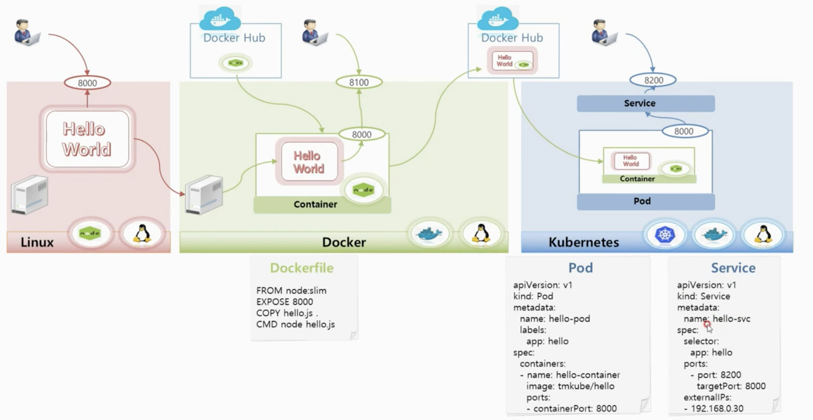

# 3강. Getting started - Kubernetes

* 도커 환경과 쿠버네티스 환경에서 실제 앱을 돌려보는 실습 시나리오
  * 리눅스 서버
    * 노드가 깔려있는 리눅스 서버에서 노드 js 앱 실행
  * 도커

    * 노드 앱을 실행할 수 있는 컨테이너 이미지를 도커 허브로부터 가져와 컨테이너로 만든다.
    * Dockerfile

    ```text
    FROM node slim
    EXPOSE 8000
    COPY hello.js
    CMD node hello.js
    ```

  * Kubernetes

    * pod

    ```text
    apiVersion: v1
    kind: Pod
    metadata:
      name: hello.pod
      labels:
        app: hello
    spec:
      containers:
      - name: hello-container
        image: tmkkube/hello
        ports
        - container:Port 8000
    ```

    * service

    ```text
    apiVersion: v1
    kind: Service
    metadata:
      name: hello.txt
    spec:
      selector
        app: hello
    ports:
      - port: 8200
      - targetPort: 8000
    extenalPs:
      - 192.168.0.30
    ```



