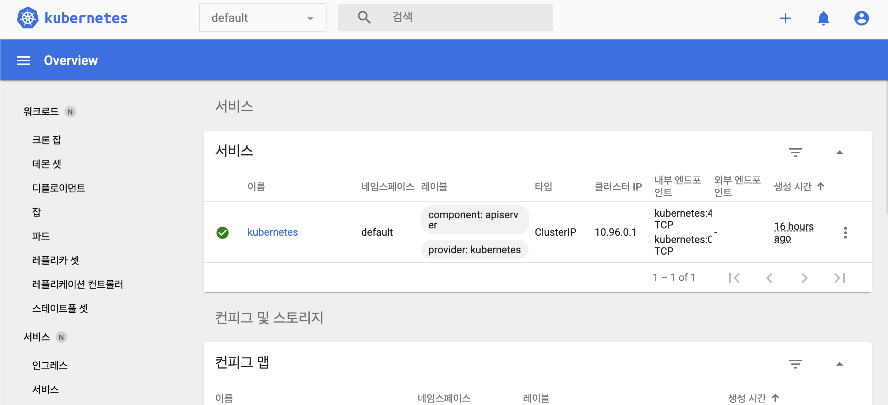
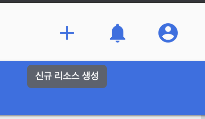
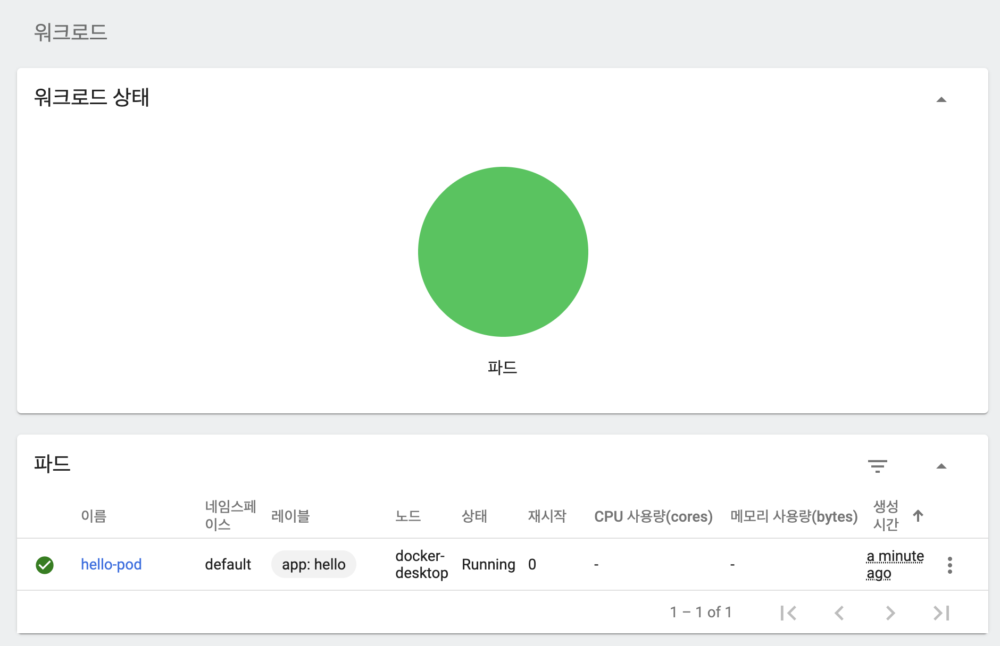
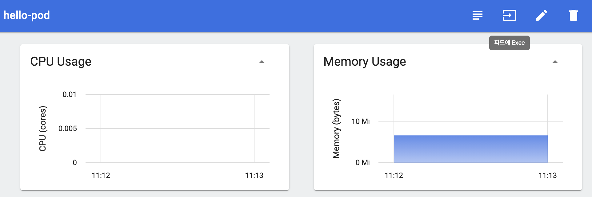
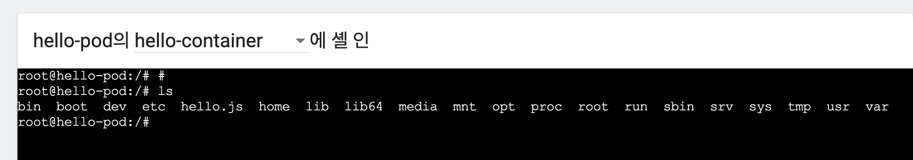
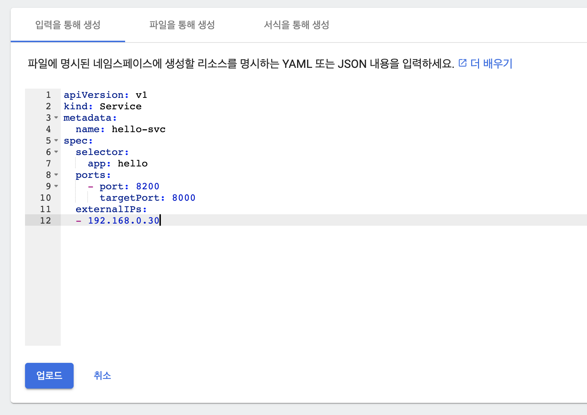
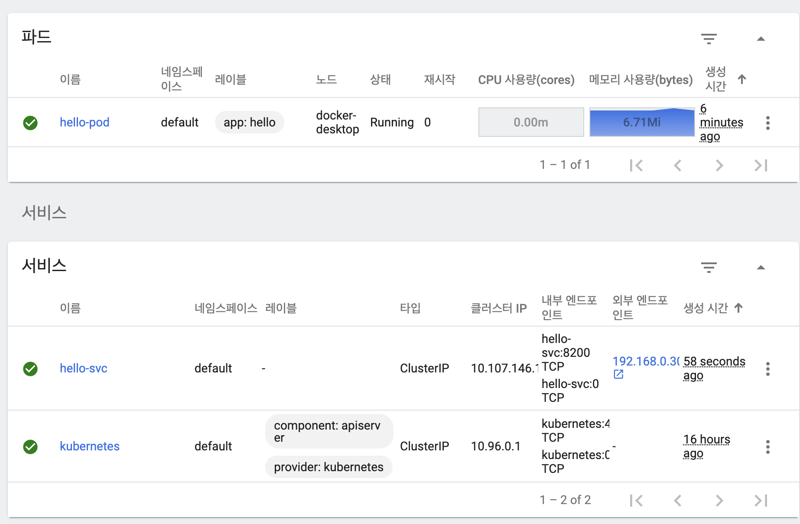

# 4강. Getting started - Kubernetes - 실습 \(2\)



## 1. kubernetes Dashboard

우선 kubernetes dashboard 환경을 준비한다. 

> 실제 운영환경에서는 k8s dashboard를 사용하는 것이 보안상의 문제로 권고되지 않는다. 테스트할 때만 사용하자.

로컬에 kubernetes dashboard 환경 셋팅이 안되어있다면 아래 링크를 참고한다.



## 2. Kubernetes Dashboard로 파드 생성하기

## 3. Kubernetes Dashboard로 Service 생성하기

방금 생성한 파드와 연결

selector 통해 방금 만든 앱과 연결 가능.

