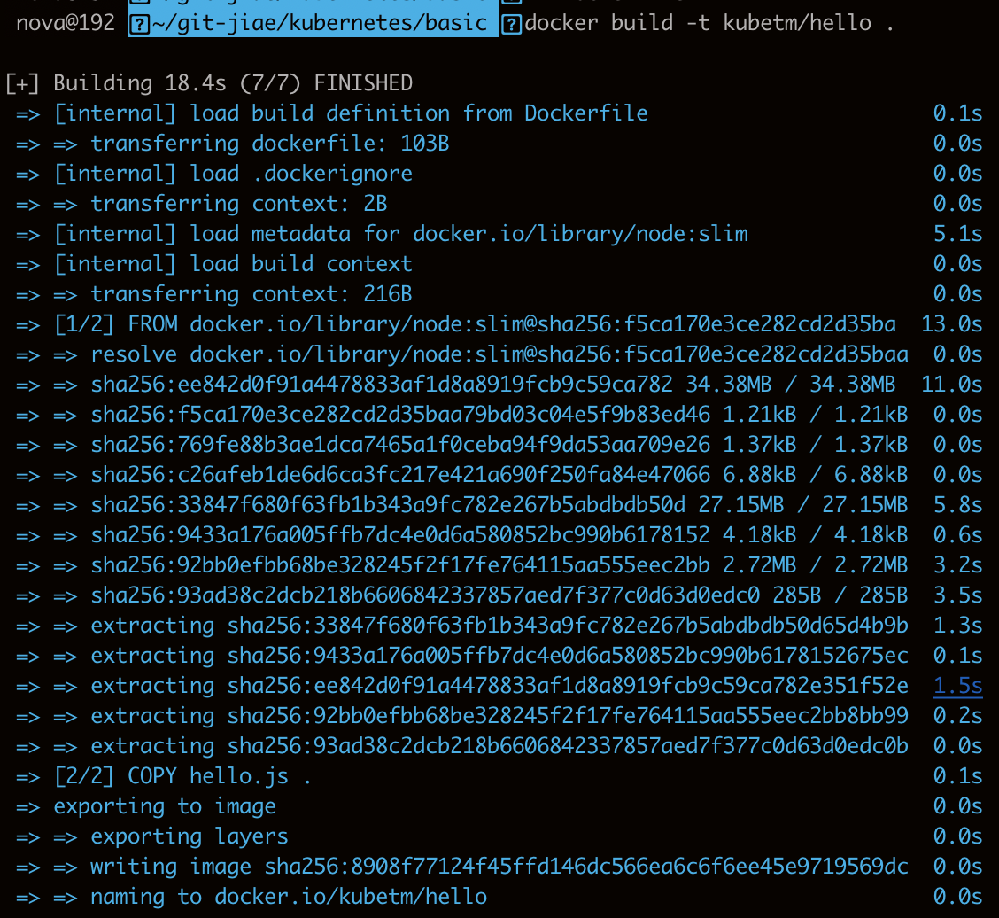
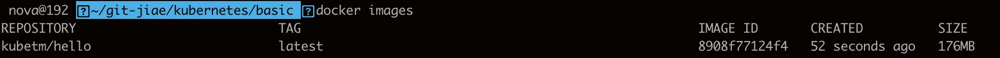
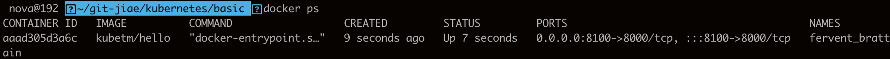
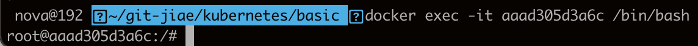
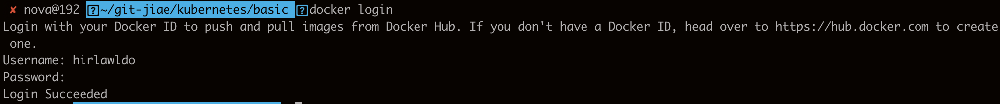
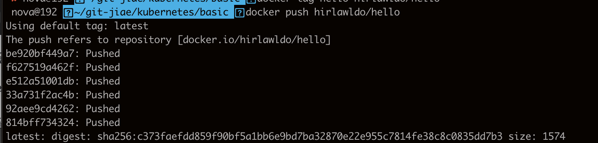
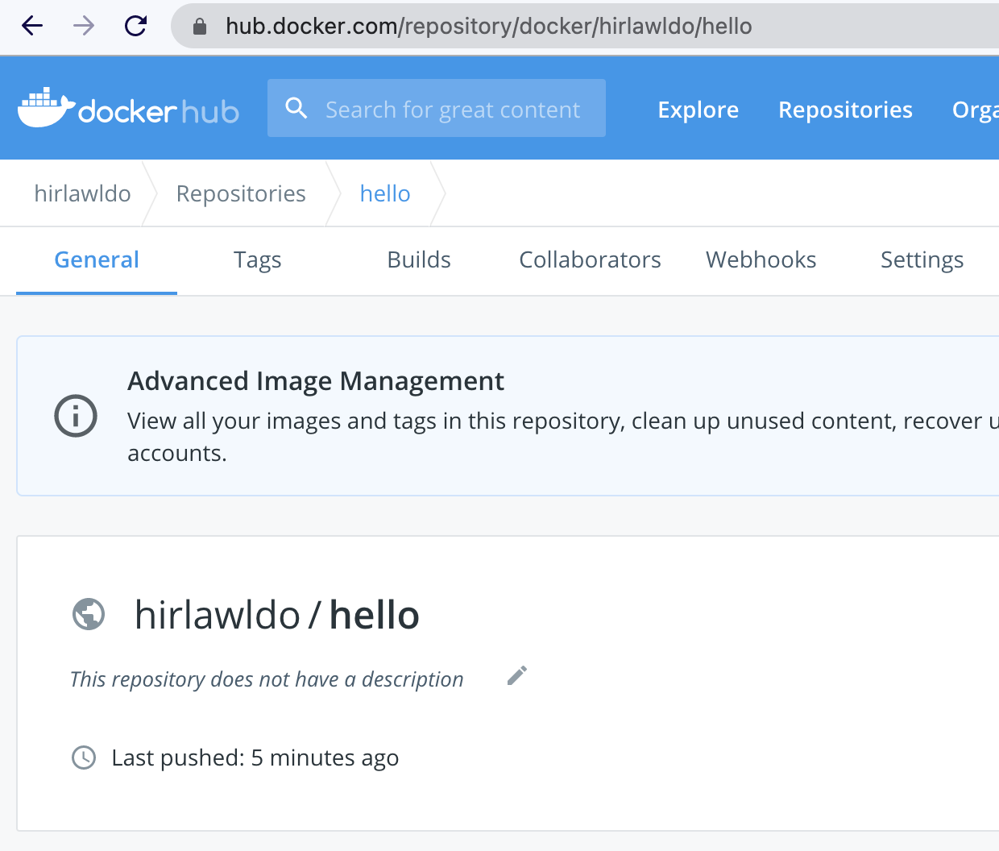

# 4강. Getting started - Kubernetes - 실습



## 1. linux 서버

* hello.js 파일 생성

```javascript
var http = require('http');
var content = function(req, resp) {
 resp.end("Hello Kubernetes!" + "\n");
 resp.writeHead(200);
}
var w = http.createServer(content);
w.listen(8000);
```

* 실행

`node hello.js`


## 2. Docker

### 2.1 Dockerfile

```text
FROM node:slim
EXPOSE 8000
COPY hello.js .
CMD node hello.js
```

### 2.2 Docker Hub Site

* [https://hub.docker.com/ ](https://hub.docker.com/

  )

### 2.3 Docker Container Run

#### 2.3.1 Docker Build

`docker build -t kubetm/hello .`



#### 2.3.2 Docker image 확인

`docker images`



#### 2.3.3 Docker 실행

`docker run -d -p 8100:8000 kubetm/hello`

* `-p 8100:8000` 8000번 포트를 8100번 포트로 매핑해서 오픈하겠다

#### 2.3.4 실행된 docker 확

`docker ps`



#### 2.3.5 docker 컨테이너 내부 접근

`docker exec -it aaad305d3a6c /bin/bash`



`exit`

### 2.4 Docker Image Push

#### 2.4.1 docker hub login

`docker login`



#### 2.4.2 docker image 를 docker hub에 push하

`docker push kubetm/hello`


denied: requested access to resource is denied. 에러 발생 시

`docker tag [imagename] [my_docker_name]/[image_name]`

`docker push [my_dockername]/[image_name]`

위 명령어 실행 시 이미지 푸시 가능 \(태그로 본인 계정 아이디를 지정하도록 함\)






도커 허브에 이미지가 성공적으로 푸시된 것을 확인할 수 있음.

### 

