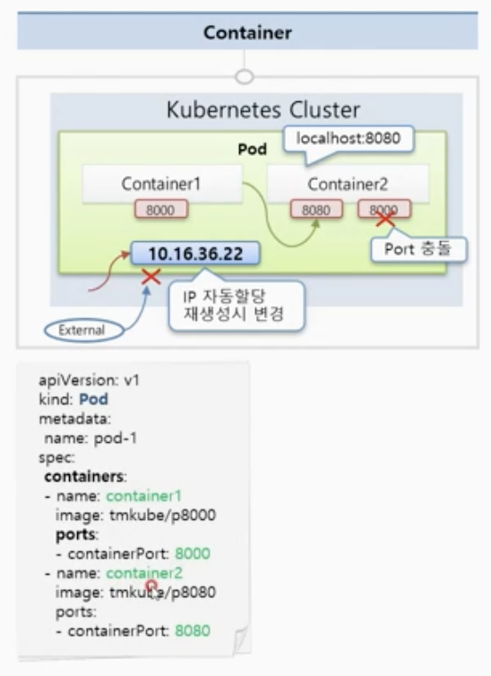
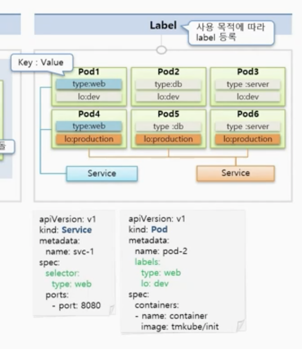
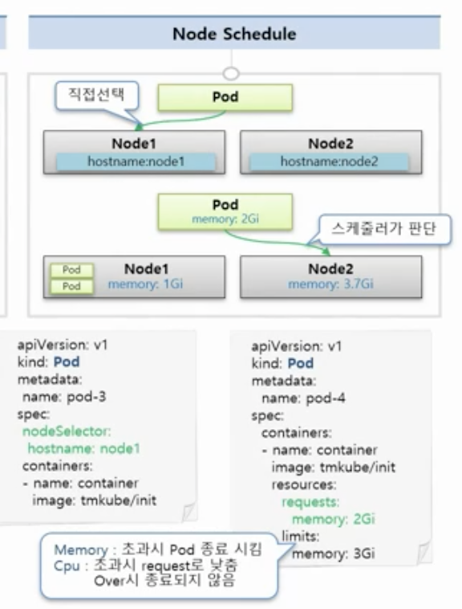

# 6강. Pod - Container, Label, NodeSchedule

### Pod

* Pod안에 하나의 독립적인 서비스를 실행시킬 수 있는 Container들이 있
*  컨테이너들은 서비스가 연결될 수 있도록 포트를 가지고 있음.
* 한 컨테이너가 여러 포트를 가질 수는 있지만 파드 내에서 포트를 중복해서 가지고 있을 수는 없음.
* 파드 내에서 다른 컨테이너에 접근할 때는 localhost:8080과 같이 컨테이너가 가진 포트로 접근할 수 있음.
* 고유의 IP 주소가 할당되는데 쿠버네티스 클러스터 내에서만 접근할 수 있고, 외부에서는 접근할 수 없음. 컨테이너에 문제가 생기면 쿠버네티스가 컨테이너를 재시작하면서 변경할 수 있는 휘발성 IP임.

### Label

* 라벨은 pod 뿐만 아니라 다른 Object 들에서도 사용 가능.
* 목적에 따라 분류하기 위해 라벨을 사
*  Key: value 한
* 아래 예시에서는 type이 web, db, server인 dev서버/production 서버로 나누어 관리
* type:web인 service만 연결해서 웹 개발자에게 알려주거나
* lo:production인 것들을 service로 연결해서 상용 운영자에게 알려줄 수 있음.

### Node Schedule

* 노드에 라벨을 달고 노드를 지정할 수 있음.
* 파드를 만날 때 NodeSelector에 특정 hostname인 애들을 선택할 수 있음.
* 노드에 자원을 request에 memory만큼 요청할 수 있고, 최대 값인 limit을 걸어둘 수 있음.
  * limit
    * Memory: 초과시 Pod 종료
    * CPU: 초과 시 request로 낮추고 over시 종료되지 않음.

* Memory: 다른 프로세스의 메모리를 침범해서 프로그램에 영향을 줄 수 있으므로 초과하면 Pod를 종료시키는 것.

