# 7강. Pod 실습

### 1. Container

#### 하나의 파드에 여러 컨테이너 생성하기

#### 1.1 Pod

```text
apiVersion: v1
kind: Pod
metadata:
  name: pod-1
spec:
  containers:
  - name: container1
    image: kubetm/p8000
    ports:
    - containerPort: 8000
  - name: container2
    image: kubetm/p8080
    ports:
    - containerPort: 8080
```

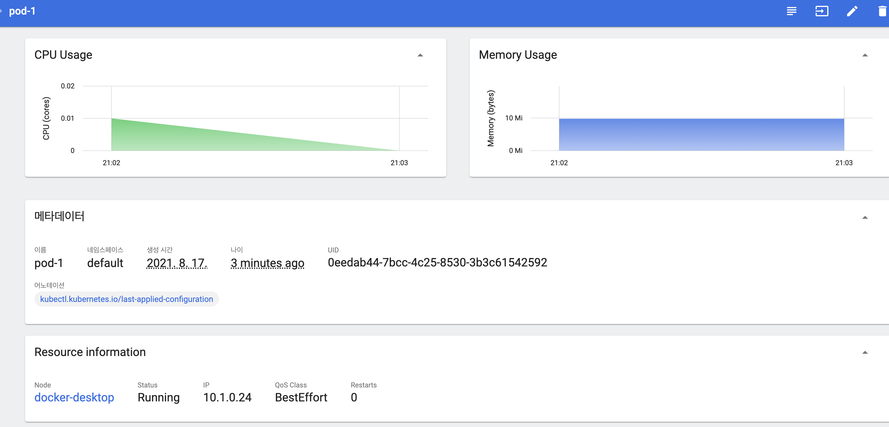

서비스 없이 Pod에 접근할 수 있는 IP로 쿠베 마스 내에서 접근 가능하다.

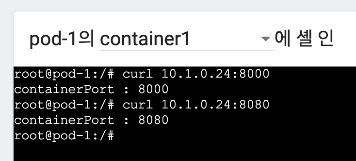

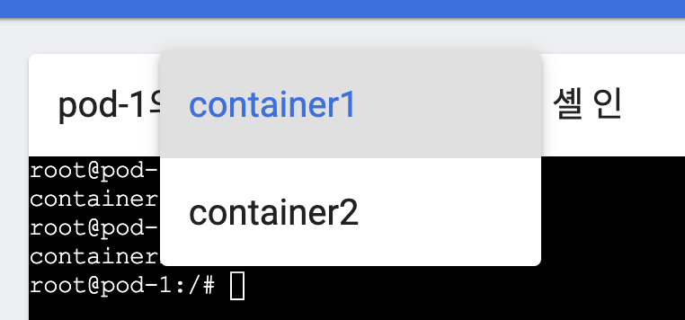


#### 

#### 같은 파드 포트로는 생성하지 못함.

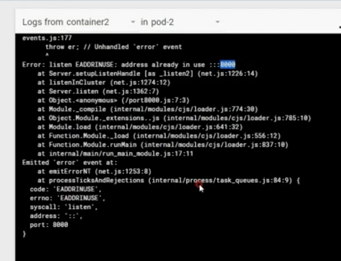

### 파드를 관리해주는 ReplicationController에 의해 IP가 바뀌어서 재생성

```text
apiVersion: v1
kind: ReplicationController
metadata:
  name: replication-1
spec:
  replicas: 1
  selector:
    app: rc
  template:
    metadata:
      name: pod-1
      labels:
        app: rc
    spec:
      containers:
      - name: container
        image: kubetm/init
```

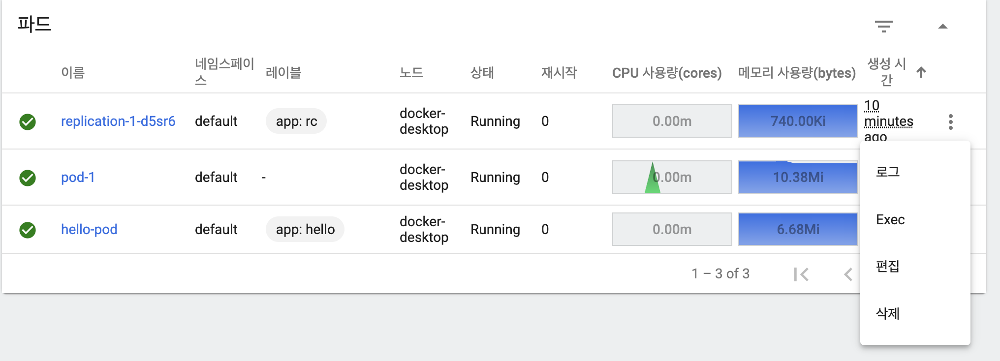

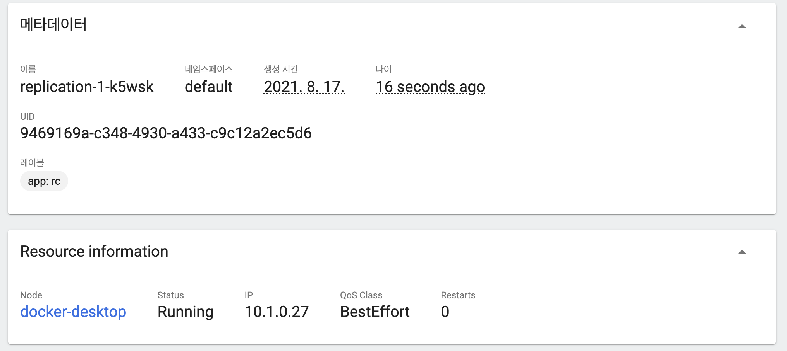

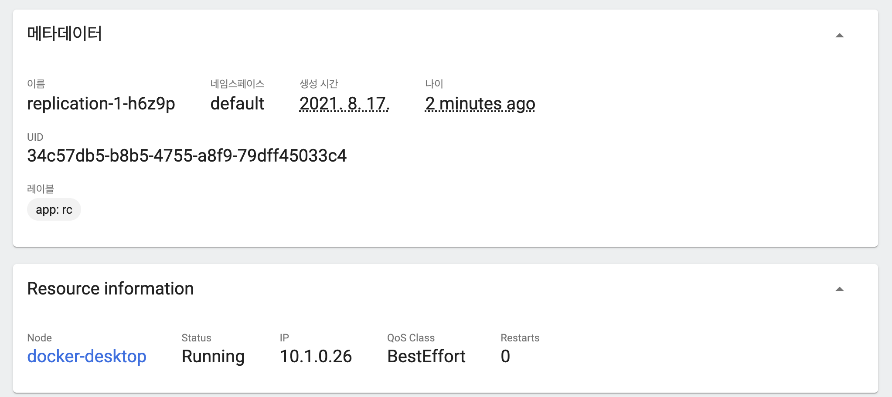


### Label

```text
apiVersion: v1
kind: Pod
metadata:
  name: pod-2
  labels:
    type: web
    lo: dev
spec:
  containers:
  - name: container
    image: kubetm/init
```

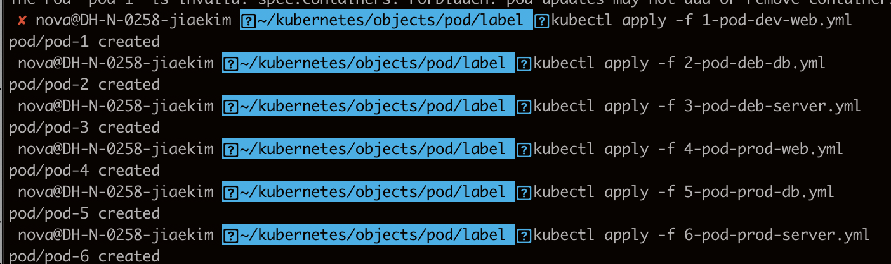

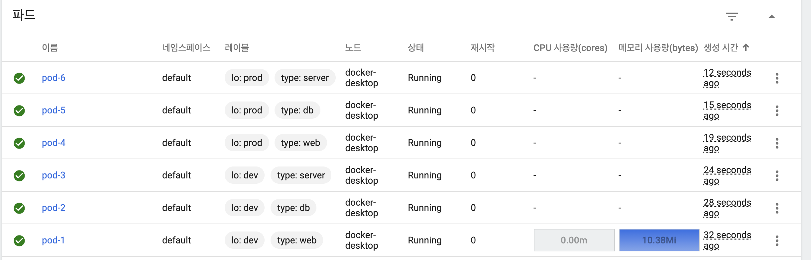

### 서비스를 연결해보자!

```text
apiVersion: v1
kind: Service
metadata:
  name: svc-1
spec:
  selector:
    type: web
  ports:
  - port: 8080
```

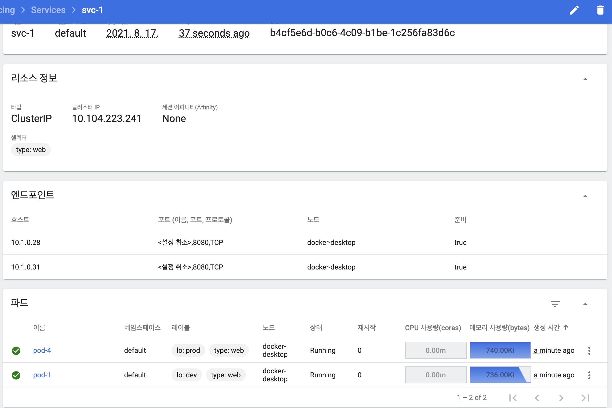

```text
apiVersion: v1
kind: Service
metadata:
  name: svc-2
spec:
  selector:
    lo: prod
  ports:
  - port: 8080
```

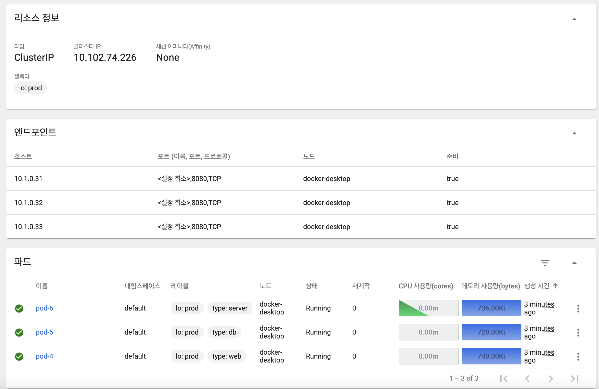

### Node Schedule


```text
apiVersion: v1
kind: Pod
metadata:
  name: pod-3
spec:
  nodeSelector:
    kubernetes.io/hostname: k8s-node1
  containers:
  - name: container
    image: kubetm/init
```


```text
apiVersion: v1
kind: Pod
metadata:
  name: pod-4
spec:
  containers:
  - name: container
    image: kubetm/init
    resources:
      requests:
        memory: 2Gi
      limits:
        memory: 3Gi
```

노드셀렉터로 지정하지 않을 경우 더 많은 자원이 남아있는 노드에 파드를 생성하는 걸 확인할 수 있음.


