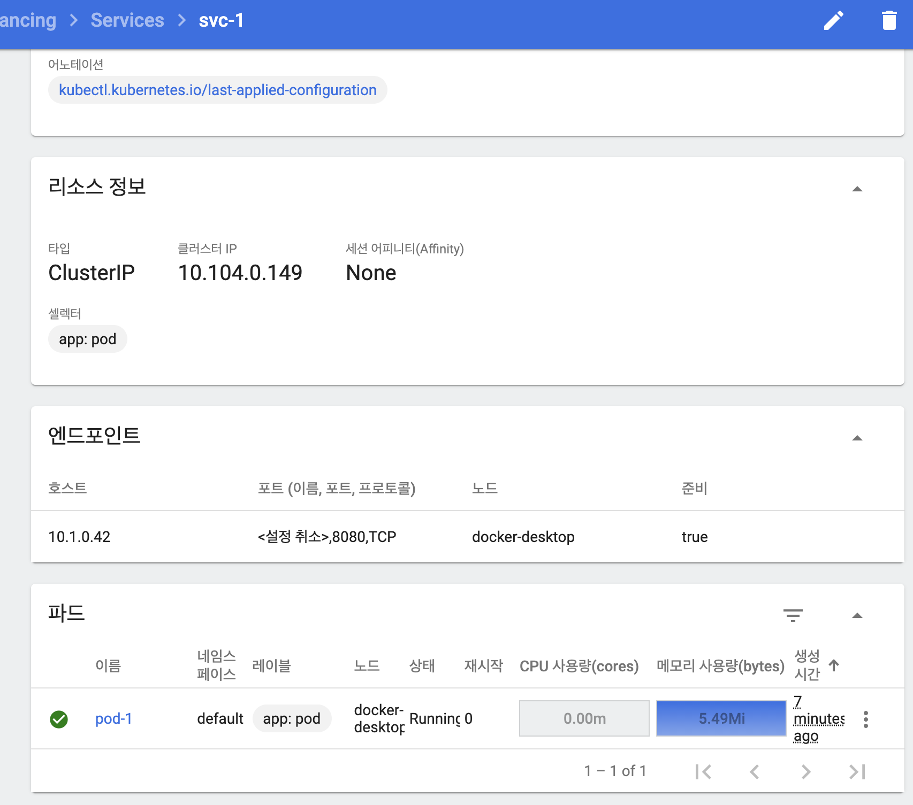
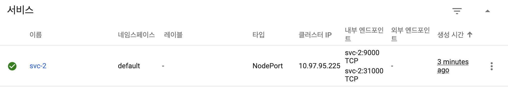
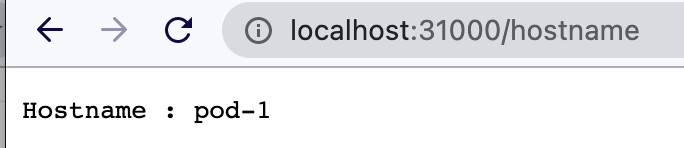
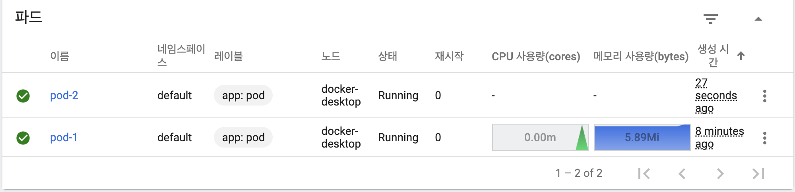
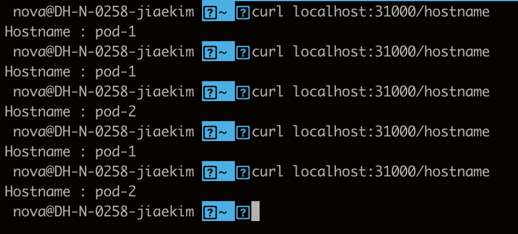
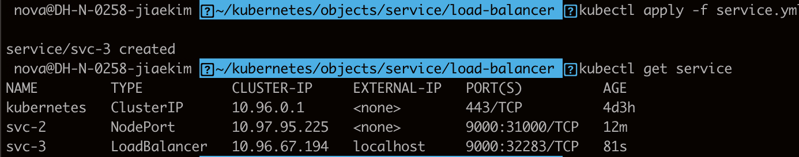
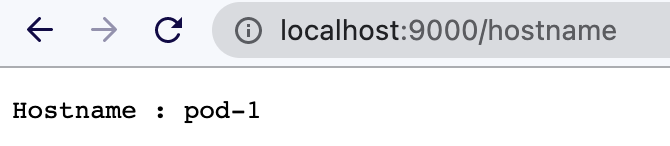

# 9강. Service - 실습

### Cluster-Ip

#### pod.yml

```text
apiVersion: v1
kind: Pod
metadata:
  name: pod-1
  labels:
     app: pod
spec:
  nodeSelector:
    kubernetes.io/hostname: k8s-node1
  containers:
  - name: container
    image: kubetm/app
    ports:
    - containerPort: 8080
```

#### service.yml

```text
apiVersion: v1
kind: Service
metadata:
  name: svc-1
spec:
  selector:
    app: pod
  ports:
  - port: 9000
    targetPort: 8080
```

클러스터 안에서 접근하면 접근 가능함.

```text
curl 10.104.0.149:9000/hostname
```

서비스의 IP는 그대로임.



### Node Port

```text
apiVersion: v1
kind: Service
metadata:
  name: svc-2
spec:
  selector:
    app: pod
  ports:
  - port: 9000
    targetPort: 8080
    nodePort: 30000
  type: NodePort
```

노드 포트의 범위는 30000-32767 사이에 있어야함!

`The Service "svc-2" is invalid: spec.ports[0].nodePort: Invalid value: 40000: provided port is not in the valid range. The range of valid ports is 30000-32767`









알아서 연결된 파드에 트래픽을 분산해서 전달해줌.

```text
apiVersion: v1
kind: Service
metadata:
  name: svc-2
spec:
  selector:
    app: pod
  ports:
  - port: 9000
    targetPort: 8080
    nodePort: 30000
  type: NodePort
  externalTrafficPolicy: Local
```

호출한 노드에 떠있는 파드로만 트래픽을 전달함.

만약 node1에 pod1이 떠있고, node2에는 pod2가 떠있지 않다면? 

node2에 접근했을 때 접근할 수 있는 파드가 없어서 계속 무한대기에 있을 수 있으니 주의할 


### Load Balancer

```text
apiVersion: v1
kind: Service
metadata:
  name: svc-3
spec:
  selector:
    app: pod
  ports:
  - port: 9000
    targetPort: 8080
  type: LoadBalancer
```

그냥 생성하면 pending 상태에서 걸려있음.

external에서 접근할 수 있도록 플러그인을 설치해주어야 함.

docker desktop에서 설치했을 경우에는 자동으로 플러그인을 설치해주는건가? 로컬에서는 pending상태가 아니라 바로 생성되서 접근이 바로 됨.





