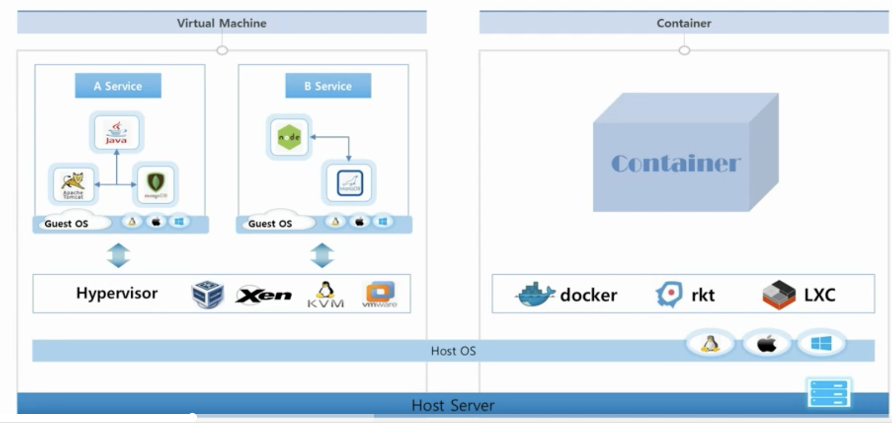
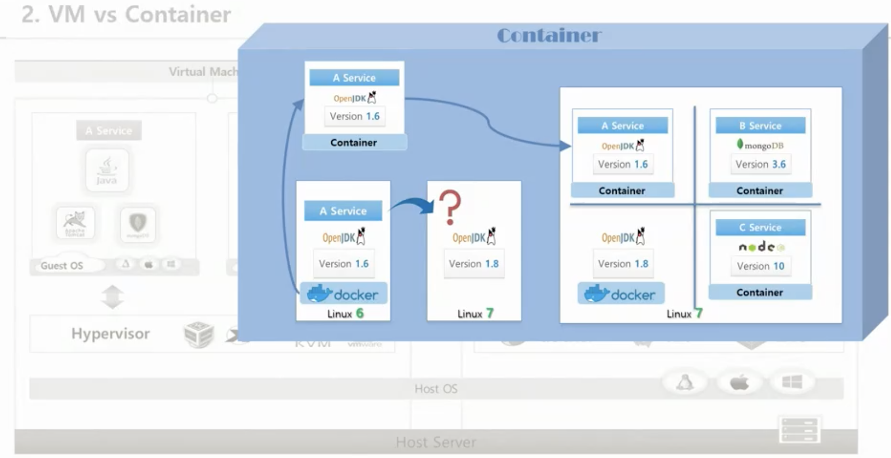
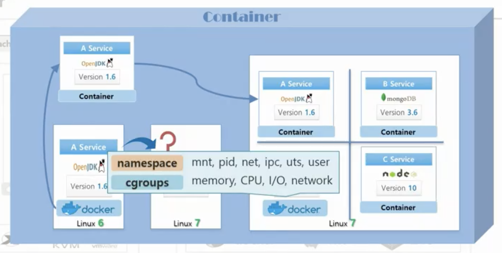
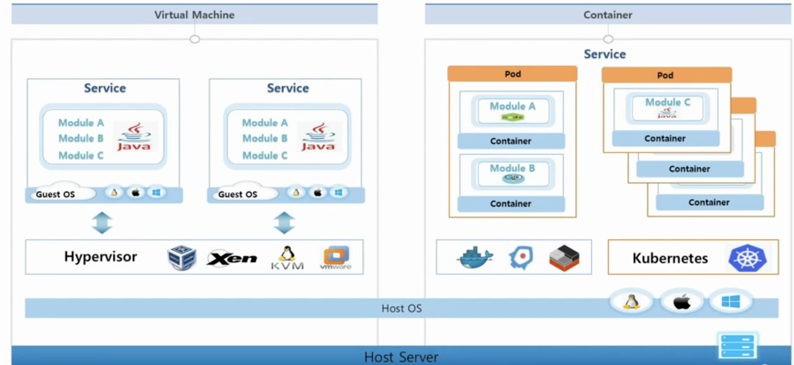

# 2강. VM vs Container

### VM vs Container 개념

* 한 서버 위에 Host OS가 올라간다.
  * VM
    * VM의 하드웨어 자원들을 가상화해주는 Hypervisor
    * Guest OS는 하나의 OS를 독립적으로 가지고 있는 것 처럼 사용 가능.
  * Container 
    * Container 가상화를 해주는 docker, lxc 등이 있음.

* linux 6 에서 개발한 서비스를 linux 7에 올린다면? 버전 차이가 발생할 수 있음. \(해당 OS에 깔고 사용한 라이브러리 버전 차이로 인한\)
* Container위에 서비스를 올리고, 해당 서비스를 사용하는데 필요한 라이브러리가 컨테이너에 함께 있음.
* 여러 컨테이너간에 호스트 자원을 분리해서 사용

* namespace: 커널에 대한 분리 \(mnt, pid, net, ipc, uts, user\)
* cgroup: 자원에 대한 분리\(memory, cpu, I/O, network\)

### VM vs Container 장단점

* VM은 각각의 OS가 뜨는 것이고 Container는 하나의 OS를 공유하는 것이기 때문에 Container가 훨씬 빠름.
* VM은 guest os가 뚫려도, 다른 host os나 guest os와 분리되어 있어서 보안적으로 문제가 되지 않지만, container는 만약 container가 뚫려서 host os를 뚫리면 다른 container에도 영향을 미칠 수 있음.

