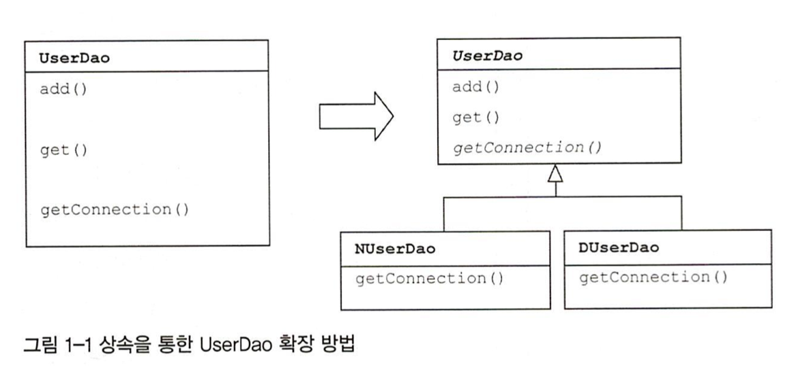
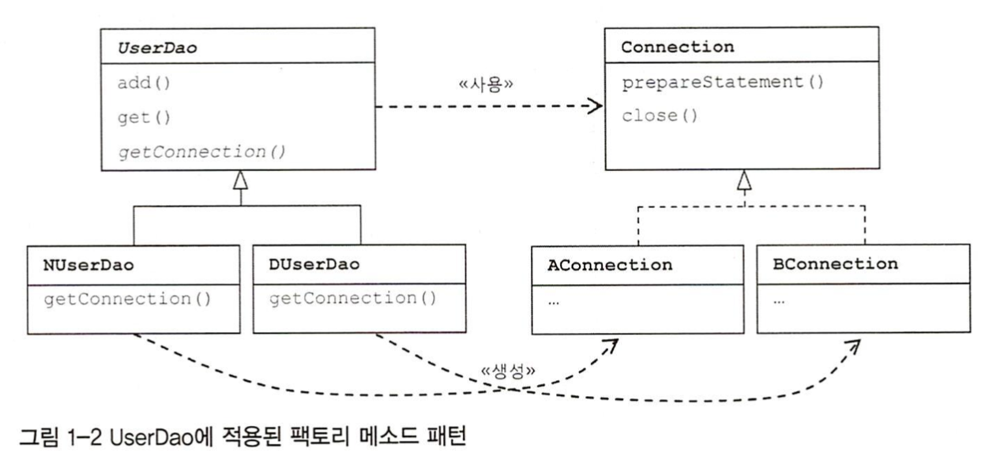
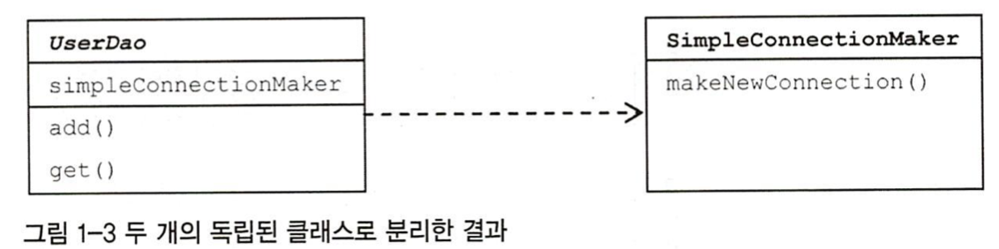
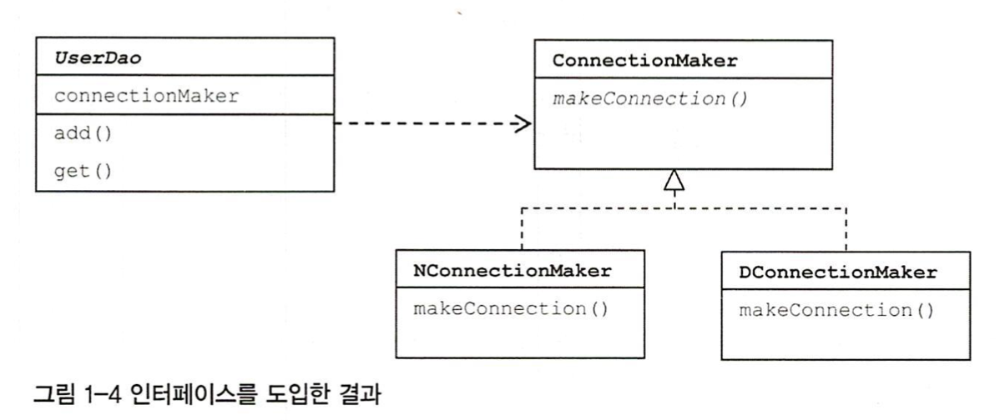
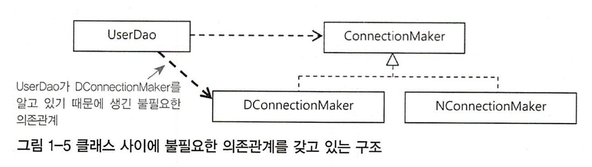
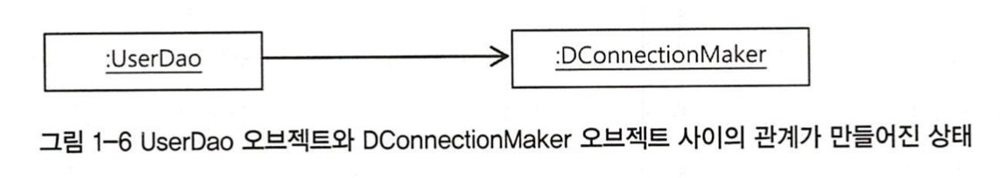
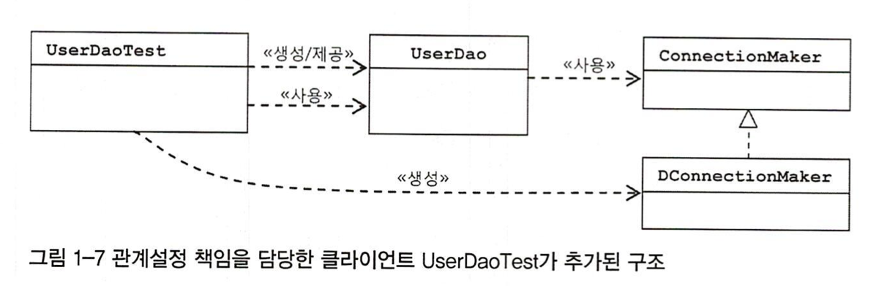

# 1강 오브젝트와 의존관계

## 초난감 DAO

User

```java
public class User {
    String id;
    String name;
    String password;

    public String getId(){
        return id;
    }

    public void setId(String id) {
        this.id = id;
    }

    public String getName(){
        return name;
    }

    public void setName(String name) {
        this.name = name;
    }

    public String getPassword(){
        return password;
    }

    public void setPassword(String password) {
        this.password = password;
    }
}
```

UserDao

```java
public class UserDao {
    public void add(User user) throws ClassNotFoundException, SQLException {
        Class.forName("com.mysql.jdbc.Driver");
        Connection connection = DriverManager.getConnection("jdbc:mysql://localhost/springbook", "market","market" );
        PreparedStatement preparedStatement = connection.prepareStatement("insert into users (id, name, password) values(?,?,?)");
        preparedStatement.setString(1, user.getId());
        preparedStatement.setString(2, user.getName());
        preparedStatement.setString(3, user.getPassword());

        preparedStatement.executeUpdate();
        preparedStatement.close();
        connection.close();
    }

    public User get(String id) throws ClassNotFoundException, SQLException {
        Connection connection = DriverManager.getConnection("jdbc:mysql://localhost/springbook", "market", "market");
        PreparedStatement preparedStatement = connection.prepareStatement("select * from users where id = ?");
        preparedStatement.setString(1, id);

        ResultSet resultSet = preparedStatement.executeQuery();
        resultSet.next();
        User user = new User();
        user.setId(resultSet.getString("id"));
        user.setName(resultSet.getString("name"));
        user.setPassword(resultSet.getString("password"));

        resultSet.close();
        preparedStatement.close();
        connection.close();

        return user;
    }
}
```

User.sql

```java
create table users (
    id varchar(10) primary key ,
    name varchar(20) not null,
    password varchar(10) not null
);
```

UserDaoTest

```java
public class UserDaoTest {

    @Test
    public void 등록과_조회() throws SQLException, ClassNotFoundException {
        UserDao dao = new UserDao();
        User user = new User();
        user.setId("whiteship");
        user.setName("백기선");
        user.setPassword("married");
        dao.add(user);

        System.out.println(user.getId() + " 등록 성공");

        User user2 = dao.get(user.getId());
        System.out.println(user2.getName());

        System.out.println(user2.getPassword());
        System.out.println(user2.getId() + " 조회 성공");
    }
}
```

## DAO의 분리

* 관심사의 분리
  * 관심사가 같은 것 끼리 모으고 다른 것은 분리해서 같은 관심에 효과적으로 집중할 수 있게 만들어주는 것
* UserDao
  * 1. DB와 연결
    2. SQL 바인딩
    3. 리소스 정
* 중복 코드의 메소드 호출 \(메소드 추출\)

  * getConnection\(\) 메소드 분리

  ```text
  private Connection getConnection() throws ClassNotFoundException, SQLException {
      Class.forName("com.mysql.jdbc.Driver");
      Connection connection = DriverManager.getConnection("jdbc:mysql://localhost/springbook", "market","market" );
      return connection;
  }
  ```

> 리팩토링
>
> 기존 코드를 외부의 동작 방식에는 변화 없이 내부 구조를 변경해서 재구성하는 작업  
> 리팩토링 \(마틴 파울러, 켄트 백 공저\) 추천

## 상속을 통한 UserDao 확장



상속을 통한 확장 방법이 제공되는 UserDao

```text
public abstract class UserDao {
    public void add(User user) throws ClassNotFoundException, SQLException {
        Connection connection = getConnection();
        ...
    }

    public User get(String id) throws ClassNotFoundException, SQLException {
        Connection connection = getConnection();
        ...
    }

    public abstract Connection getConnection() throws ClassNotFoundException, SQLException;
}
```

```text
public class DUserDao extends UserDao {
    @Override
    public Connection getConnection() throws ClassNotFoundException, SQLException {
        // N 사의 DB Connection 생성 코드
        Class.forName("com.mysql.jdbc.Driver");
        Connection connection = DriverManager.getConnection("jdbc:mysql://localhost/springbook", "market","market" );
        return connection;
    }
}
```

```text
public class NUserDao extends UserDao {
    @Override
    public Connection getConnection() throws ClassNotFoundException, SQLException {
        // D 사의 DB Connection 생성 코드
        Class.forName("com.mysql.jdbc.Driver");
        Connection connection = DriverManager.getConnection("jdbc:mysql://localhost/springbook", "market","market" );
        return connection;
    }
}
```

> **템플릿 메소드 패턴**
>
> 슈퍼클래스에 기본적인 로직의 흐름을 만들고, 그 기능의 일부를 추상 메소드나 오버라이딩이 가능한 protected 메소드 등으로 만든 뒤 서브클래스에서 이런 메소드를 필요에 맞게 구현해서 사용하도록 하는 방



> **디자인 패턴**
>
> 소프트웨어 설계 시 특정 상황에서 자주 만나는 문제를 해결하기 위해 사용할 수 있는 재사용 가능한 솔루션. 패턴에서 가장 중요한 것은 각 패턴의 핵심이 담긴 목적 또는 의도다. 패턴을 적용할 상황, 해결해야 할 문제, 솔루션의 구조와 각 요소의 역할과 함께 핵심 의도가 무엇인지를 기억해둬야 한다.  
> 디자인 패턴은 객체 지향 언어인 자바를 사용하는 개발자라면 반드시 공부해야 할 주제다. 'GoF의 디자인 패턴' 또는 'Head First Design Patterns'책을 추천한다.
>
> **템플릿 메소드 패턴**
>
> 상속을 통해 슈퍼클래스의 기능을 확장할 때 사용되는 가장 대표적인 방법. 변하지 않는 기능은 슈퍼클래스에 만들어두고 자주 변경되며 확장할 기능은 서브 클래스에 만든다. 슈퍼클래스에서는 미리 추상 메소드 또는 오버라이드 가능한 메서드를 정의해두고 이를 활용해 코드의 기본 알고리즘을 담고 있는 템플릿 메소드를 만든다. 슈퍼 클래스에서 디폴트 기능을 정의해두거나 비워뒀다가 서브클래스에서 선택적으로 오버라이드할 수 있도록 만들어둔 메소드를 훅\(hook\) 메소드라고 한다. 서브클래스에서는 추상 메소드를 구현하거나, 훅 메소드를 오버라이드하는 방법을 이용해 기능의 일부를 확장한다.
>
> public abstract class Super {  
> public void templateMethod\(\){  
> // 기본 알고리즘 코드  
> hookMethod\(\);  
> abstractMethod\(\);  
> ...  
> }  
> protected void hookMethod\(\) { } // 선택적으로 오버라이드 가능한 훅 메소드  
> public abstract void abstractMethod\(\); // 서브클래스에서 반드시 구현해야 하는 추상 메소  
> }  
>   
> public class Sub1 extends Super {  
> protected void hookMethod\(\) {  
> ...  
> }  
> public void abstractMethod\(\){  
> ...  
> }  
> }
>
> **팩토리 메소드 패턴**
>
> 팩토리 메서드 패턴도 템플릿 메소드 패턴과 마찬가지로 상속을 이용해 기능을 확장하게 하는 패턴이다. 그래서 구조도 비슷하다. 슈퍼클래스 코드에서는 서브 클래스에서 구현할 메서드를 호출해서 필요한 타입의 오브젝트를 가져와 사용한다. 이 메소드는 주로 인터페이스 타입으로 오브젝트를 리턴하므로 서브클래스에서 정확히 어떤 클래스의 오브젝트를 만들어 리턴할지는 슈퍼클래스에서는 알지 못한다. \(사실 관심도 없다.\) 서브클래스는 다양한 방법으로 오브젝트를 생성하는 메서드를 재정의할 수 있다. 이렇게 서브클래스에서 오브젝트 생성 방법과 클래스를 결정할 수 있도록 미리 정의해둔 메서드를 팩토리 메소드라고 하고, 이 방식을 통해 오브젝트 생성 방법을 나머지 로직, 즉 슈퍼클래스의 기본 코드에서 독립시키는 방법을 팩토리 메서드 패턴이라고 한다. 그림 1-2는 팩토리 메서드 패턴의 구조를 잘 나타내고 있다. 자바에서는 종종 오브젝트를 생성하는 기능을 가진 메소드를 일반적으로 팩토리 메서드라고 부르기도 한다. 이때 말하는 팩토리 메서드와 팩토리 메서드 패턴의 팩토리 메소드는 의미가 다르므로 혼동하지 않도록 주의해야 한다.

이렇게 템플릿 메소드 패턴 혹은 팩토리 메소드 패턴으로 관심사항이 다른 코드를 분리해내고, 서로 독립적으로 변경 또는 확장할 수 있도록 만드는 것은 간단하면서도 매우 효과적인 방법이다.

하지만 이 방법은 상속을 사용했다는 단점이 있다. 상속 자체는 간단해 보이고 사용하기도 편리하게 느껴지지만 사실 많은 한계점이 있다.  
단점1\) UserDao가 다른 목적을 위해 상속을 사용하고 있다면? \(자바는 클래스의 다중상속을 허용하지 않는다.\)  
단점2\) 상속을 통한 상하위 클래스의 관계는 생각보다 밀접하다. 그래서 슈퍼클래스 내부의 변경이 있을 때 모든 서브클래스를 함께 수정하거나 다시 개발해야할 수도 있다.  
단점3\) 확장된 기능인 DB 커넥션을 생성하는 코드를 다른 DAO 클래스에 적용할 수 없다.

## 클래스의 분리

두 개의 관심사를 본격적으로 독립시키면서 동시에 손쉽게 확장할 수 있는 방법을 알아보자.



SimpleConnectionMaker라는 새로운 클래스를 만들고 DB 생성 기능을 그 안에 넣는다.

```text
public class UserDao {
    private SimpleConnectionMaker simpleConnectionMaker;

    public UserDao(SimpleConnectionMaker simpleConnectionMaker) {
        this.simpleConnectionMaker = new SimpleConnectionMaker();
    }

    public void add(User user) throws ClassNotFoundException, SQLException {
        Connection connection = simpleConnectionMaker.makeNewConnection();
        ...
    }

    public User get(String id) throws ClassNotFoundException, SQLException {
        Connection connection = simpleConnectionMaker.makeNewConnection();
        ...
    }
}
```

```text
public class SimpleConnectionMaker {
    public Connection makeNewConnection() throws ClassNotFoundException, SQLException {
        Class.forName("com.mysql.jdbc.Driver");
        Connection connection = DriverManager.getConnection("jdbc:mysql://localhost/springbook", "market","market" );
        return connection;
    }
}
```

이렇게 클래스를 분리한 경우에도 상속을 이용했을 때와 마찬가지로 자유로운 확장이 가능하게 하려면 **두 가지 문제**를 해결해야 한다.

1. SimpleConnectionMaker의 makeNewConnection\(\)을 이용해 DB 커넥션을 가져오게 했는데, 만약 D사에서 만든 DB 커넥션 제공 클래스는 openConnection\(\)이라는 메소드를 이용했다면 메소드를 다음과 같이 모두 변경해야 한다. `Connection c = simpleConnectionMaker.openConnection();` 
2. DB 커넥션을 제공하는 클래스가 어떤 것인지를 UserDao가 구체적으로 알고 있어야 한다.

## 인터페이스의 도입

가장 좋은 해결책은 두 개의 클래스가 서로 긴밀하게 연결되어 있지 않도록 중간에 추상적인 느슨한 연결고리를 만들어주는 것이다. 추상화란 어떤 것들의 공통적인 성격을 뽑아내어 이를 따로 분리해주는 작업이다. 자바가 추상화를 위해 제공하는 가장 유용한 도구는 바로 인터페이스다.



```text
public interface ConnectionMaker {
    public Connection makeConnection() throws ClassNotFoundException, SQLException;
}
```

```text
public class UserDao {
    private ConnectionMaker connectionMaker;

    public UserDao(SimpleConnectionMaker simpleConnectionMaker) {
        connectionMaker = new DConnectionMaker();
    }

    public void add(User user) throws ClassNotFoundException, SQLException {
        Connection connection = connectionMaker.makeConnection();
        ...
    }

    public User get(String id) throws ClassNotFoundException, SQLException {
        Connection connection = connectionMaker.makeConnection();
        ...
    }
}
```

```text
public class DConnectionMaker implements ConnectionMaker {

    @Override
    public Connection makeConnection() throws ClassNotFoundException, SQLException {
        Class.forName("com.mysql.jdbc.Driver");
        Connection connection = DriverManager.getConnection("jdbc:mysql://localhost/springbook", "market","market" );
        return connection;
    }
}
```

아직도 문제가 있다. UserDao에 아직도 DConnectionMaker를 생성하는 코드가 남아있다.  
`connectionMaker = new DConnectionMaker();`

만약 NConnectionMaker를 사용하게 하려면 UserDao의 코드를 뜯어 고쳐서 이번에는 NConnectMaker와 관계를 맺도록 만들어야 한다.

오브젝트 사이의 관계가 만들어지려면 일단 만들어진 오브젝트가 있어야 하는데, 이처럼 직접 생성자를 호출해서 직접 오브젝트를 만드는 방법도 있지만 외부에서 만들어준 것을 가져오는 방법도 있다.



UserDao의 모든 코드는 ConnectionMaker 인터페이스 외에는 어떤 클래스와도 관계를 가져서는 안 되게 해야 한다.

코드에서는 특정 클래스를 전혀 알지 못하더라도 해당 클래스가 구현한 인터페이스를 사용했다면, 그 클래스의 오브젝트를 인터페이스 타입으로 받아서 사용할 수 있다. 바로 객체지향 프로그램에는 다형성이라는 특징이 있는 덕분이다.

UserDao 오브젝트가 DConnectionMaker 오브젝트를 사용하게 하려면 두 클래스의 오브젝트 사이에 런타임 사용관계 또는 링크, 또는 의존관계라고 불리는 관계를 맺어주면 된다.



클라이언트는 자신이 ConnectionMaker의 구현 클래스를 선택하고, 선택한 클래스의 오브젝트를 생성해서 UserDao와 연결해준다.

```text
public UserDao(ConnectionMaker connectionMaker) {
    this.connectionMaker = connectionMaker;
}
```

```text
public class UserDaoTest {

    @Test
    public void 등록과_조회() throws SQLException, ClassNotFoundException {
        ConnectionMaker connectionMaker = new DConnectionMaker();
        UserDao dao = new UserDao(connectionMaker);
        ...
    }
}
```

UserDaoTest는 UserDao와 ConnectionMaker 구현 클래스와의 런타임 오브젝트 의존 관계를 설정하는 책임을 담당한다.

만약 ConnectionMaker의 구현체를 바꾸어서 사용하고 싶다는 요구사항이 있다면, 클라이언트에서 다른 구현체를 사용하면 된다.



앞에서 사용했던 상속을 통한 확장방법보다 유연하게 UserDao와 ConnectionMaker 클래스를 분리하고, 서로 영향을 주지 않으면서도 필요에 따라 자유롭게 확장할 수 있는 구조가 됐다.

다음은 객체지향 설계와 프로그래밍의 이론을 통해서 마지막으로 적용한 방법을 좀 더 체계적으로 살펴보자.

## 원칙과 패턴

### 개방 폐쇄의 원칙 \(Open Closed Principle\)

클래스나 모듈은 확장에는 열려있어야 하고 변경에는 닫혀있어야 한다.

> 객체지향 설계 원칙 \(SOLID\)
>
> 로버트마틴이 정리한 5가지 객체지향 설계 원칙  
> 밥 마틴의 'Java 프로그래머를 위한 UML 실전에서는 이것만 쓴다', '소프트웨어 개발의 지혜: 원칙, 디자인패턴, 실천 방법' 추천
>
> SOLID 5원칙
>
> * SRP\(Single Responsibility Principle\): 단일 책임 원칙  
> * OCP\(Open Closed Principle\): 개방 폐쇄 원칙  
> * LSP\(Liskov Substitution Principle\): 리스코프 치환 원칙  
> * ISP\(Interface Segregation Principle\): 인터페이스 분리 원칙  
> * DIP\(Dependency Inversion Principle\): 의존관계 역전 원

## 높은 응집도와 낮은 결합도

### 높은 응집도

하나의 모듈, 클래스가 하나의 책임 또는 관심사에만 집중되어 있다. 불필요하거나 직접 관련이 없는 외부의 관심과 책임이 얽혀 있지 않으며, 하나의 공통 관심사에는 한 클래스에 모여 있다.

응집도가 높으면 변화가 일어날 때 해당 모듈에서 변하는 부분이 크다. 즉, 변경이 일어날 때 모듈의 많은 부분이 함께 바뀐다면 응집도가 높다.

### 낮은 결합도

책임과 관심사가 다른 오브젝트 또는 모듈과는 낮은 결합도, 즉 느슨하게 연결된 형태를 유지하는 것이 바람직하다. 느슨한 연결은 낮은 관계를 유지하는데 꼭 필요한 최소한의 방법만 간접적인 형태로 제공하고, 나머지는 서로 독립적이고 알 필요도 없게 만들어주는 것이다. 결합도가 낮아지면 변화에 대응하는 속도가 높아지고, 구성이 깔끔해진다. 또한 확장하기에도 매우 편리하다.

`결합도: 하나의 오브젝트가 변경이 일어날 때에 관계를 맺고 있는 다른 오브젝트에게 변화를 요구하는 정도`

결국 **낮은 결합도는 하나의 변경이 발생할 때 마치 파문이 이는 것처럼 여타 모듈과 객체로 변경에 대한 요구가 전파되지 않는 상태**를 말한다. 결합도가 높아지면 변경에 따르는 작업량이 많아지고, 변경으로 인해 버그가 발생할 가능성이 높아진다.

## 전략 패턴

* 전략 패턴

  `필요에 따라 변경이 필요한 알고리즘을 인터페이스를 통해 통째로 외부로 분리시키고, 이를 구현한 구체적인 알고리즘 클래스를 필요에 따라 바꿔서 사용할 수 있게 하는 디자인 패턴`  

