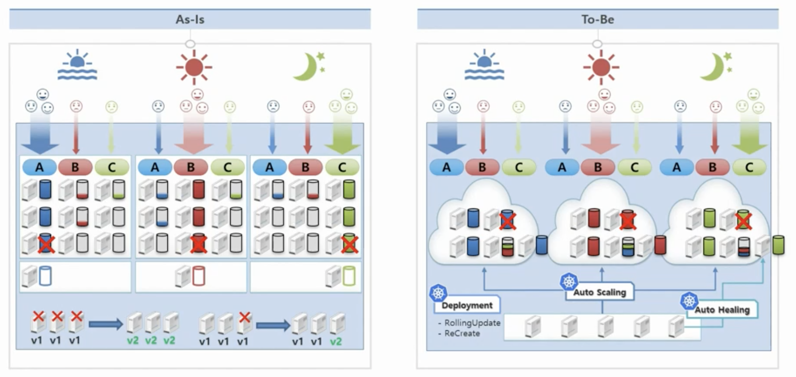

# 1강. Why Kubernetes?

* 서버 자원을 효율적으로 사용할 수 있다.
  * 시간대 별 오토스케일 가능.
    * A가 아침, B는 점심, C는 저녁시간대에 트래픽이 높을 경우
    * 시간대별로 오토스케일을 이용하여 적은 자원\(서버\)로 동일한 서비스를 유지할 수 있고, 트래픽이 몰릴 때 오토스케일을 통해 안정적으로 서비스를 운영할 수 있다.

