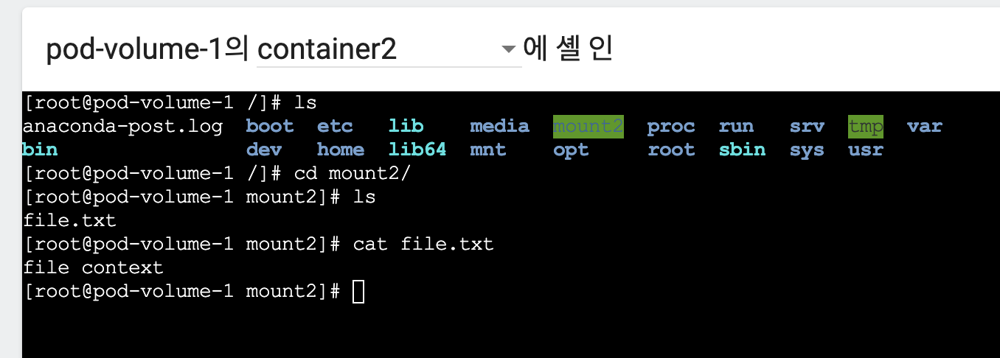
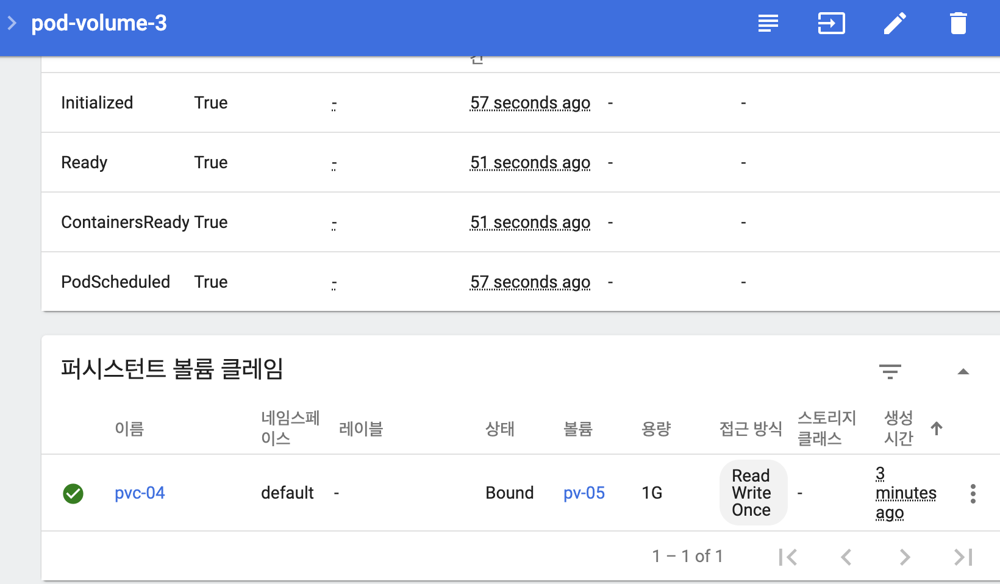

# 11장. Volume 실습

### EmptyDir

```text
apiVersion: v1
kind: Pod
metadata:
  name: pod-volume-1
spec:
  containers:
  - name: container1
    image: kubetm/init
    volumeMounts:
    - name: empty-dir
      mountPath: /mount1
  - name: container2
    image: kubetm/init
    volumeMounts:
    - name: empty-dir
      mountPath: /mount2
  volumes:
  - name : empty-dir
    emptyDir: {}
```




파드가 지워지면 파일도 날아감.

### HostPath

```text
apiVersion: v1
kind: Pod
metadata:
  name: pod-volume-4
spec:
  nodeSelector:
    kubernetes.io/hostname: docker-desktop
  containers:
  - name: container
    image: kubetm/init
    volumeMounts:
    - name: host-path
      mountPath: /mount1
  volumes:
  - name : host-path
    hostPath:
      path: /node-v
      type: DirectoryOrCreate
```

* **hostPath Type**
  * DirectoryOrCreate : 실제 경로가 없다면 생성
  * Directory : 실제 경로가 있어야됨
  * FileOrCreate : 실제 경로에 파일이 없다면 생성
  * File : 실제 파일이 었어야함


### PV와 PVC

### PV 3개를 capacity, accessMode를 바꿔서 생

```text
apiVersion: v1
kind: PersistentVolume
metadata:
  name: pv-01
spec:
  capacity:
    storage: 1G
  accessModes:
  - ReadWriteOnce
  local:
    path: /node-v
  nodeAffinity:
    required:
      nodeSelectorTerms:
      - matchExpressions:
        - {key: kubernetes.io/hostname, operator: In, values: [docker-desktop]}
```

```text
apiVersion: v1
kind: PersistentVolume
metadata:
  name: pv-02
spec:
  capacity:
    storage: 2G
  accessModes:
  - ReadOnlyMany
  local:
    path: /node-v
  nodeAffinity:
    required:
      nodeSelectorTerms:
      - matchExpressions:
        - {key: kubernetes.io/hostname, operator: In, values: [docker-desktop]}
```

```text
apiVersion: v1
kind: PersistentVolume
metadata:
  name: pv-03
spec:
  capacity:
    storage: 2G
  accessModes:
  - ReadWriteOnce
  local:
    path: /node-v
  nodeAffinity:
    required:
      nodeSelectorTerms:
      - matchExpressions:
        - {key: kubernetes.io/hostname, operator: In, values: [docker-desktop]}
```

### PVC

```text
apiVersion: v1
kind: PersistentVolumeClaim
metadata:
  name: pvc-04
spec:
  accessModes:
  - ReadWriteOnce
  resources:
    requests:
      storage: 1G
  storageClassName: ""
```


용량과 접근방식에 맞는거에 생성해줌.

적합한 상태인 PV가 없다면 PVC가 binding상태로 멈춤.

자신보다 높은 용량이 있는 스토리지에는 할당해줌.

```text
apiVersion: v1
kind: Pod
metadata:
  name: pod-volume-3
spec:
  containers:
  - name: container
    image: kubetm/init
    volumeMounts:
    - name: pvc-pv
      mountPath: /mount3
  volumes:
  - name : pvc-pv
    persistentVolumeClaim:
      claimName: pvc-04
```



