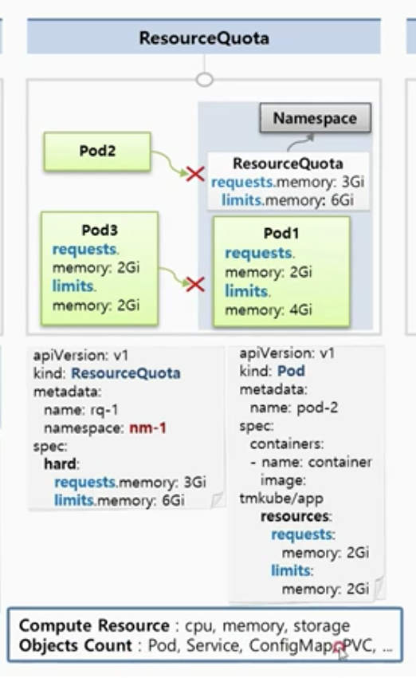

# 14장. Namespace, ResourceQuota, LimitRange

## 개요

### Namespace, Resource Quota, LimitRange를 사용해야 하는 이유

* 쿠버네티스 클러스터 내에 Memory, CPU와 같은 자원이 있고, 이 자원을 각 pod들이 사용함.
* 한 pod가 자원을 과하게 사용한다면 다른 pod들이 해당 자원들을 사용하지 못해서 문제가 될 수 있음.

* 그래서 각 namespace마다 resource quota로 최대 자원 한계를 설정가능.
* 다른 namespace에 자원이 부족하게 하는 등의 영향을 끼치지 않게 해줌.

* 만약 위 예시처럼 한 pod가 namespace의 자원을 전부 사용해버린다면? 다른 pod가 해당 namespace에 들어오지 못함.
* 이런 경우를 방지 하기 위해 해당 namespace에 들어올 수 있는 pod의 최대 자원할당량을 제한할 수 있음.

### 

## Namespace

* 한 namespace 내에 다른 pod들은 name이 중복될 수 없다.
* 다른 namespace의 자원과는 분리가 되어 관리가 된다. 따라서 다른 namespace의 서비스-POD는 연결이 안됨. \(PV나 Node 외 대부분의 오브젝트는 분리된 namespace 에 있는 자원에 접근할 수 없음.

## ResourceQuota

* namespace의 자원 한계를 설정하는 Object
* resourceQuota를 지정한 namespace에는 자원의 requests와 limits를 반드시 명시해 주어야 하고, 한계치를 넘어서는 생성할 수 없음.
* cpu, memory, storage 제한 가능
* 자원의 갯수도 제한할 수 있음. Pod, Service, ConfigMap 등..\)

## LimitRange

* max보다 넘는 limit을 설정한 pod는 들어오지 못함.
* maxLimitRequestRatio 값을 설정하면 request \* maxLimitRequestRatio &lt;= limits인 자원만 들어올 수 있음.
* defaultRequest, default 값을 설정하면 limit을 걸지 않은 pod라면 자동으로 default 값으로 설정되어 들어감.

